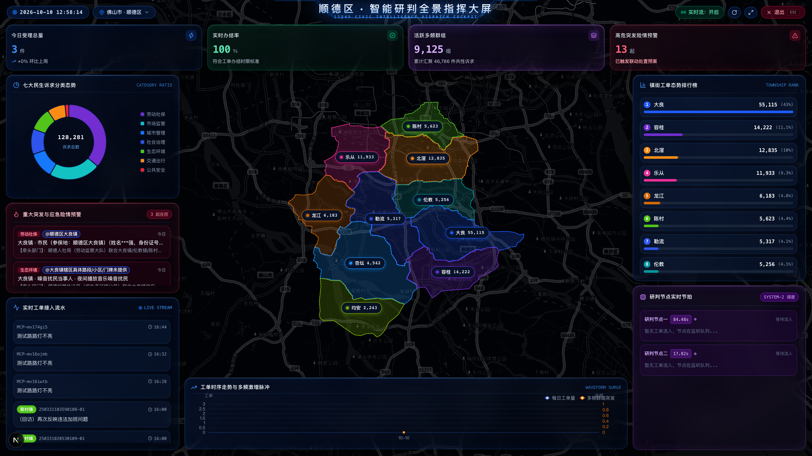
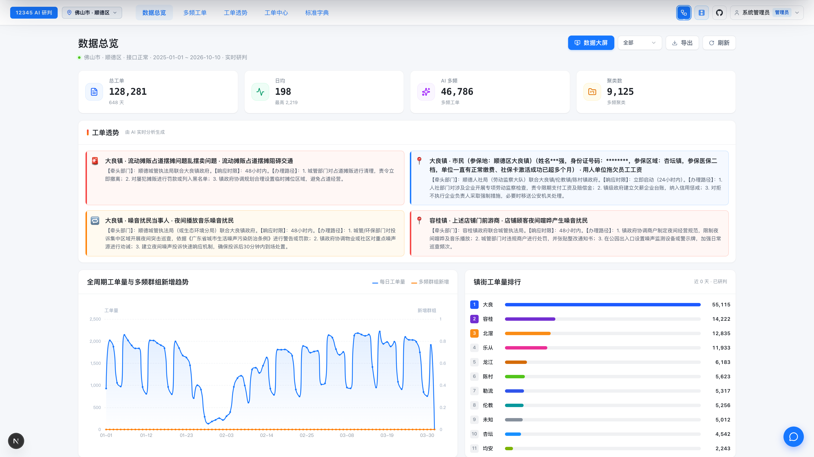
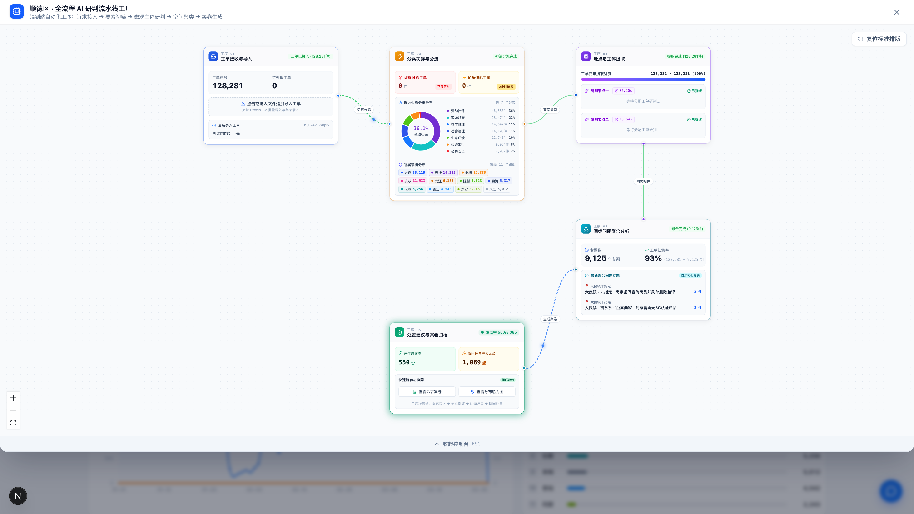
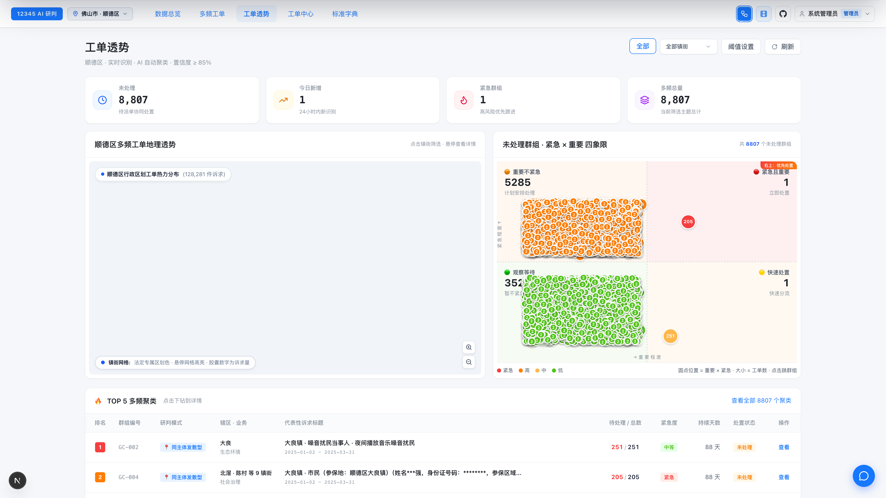
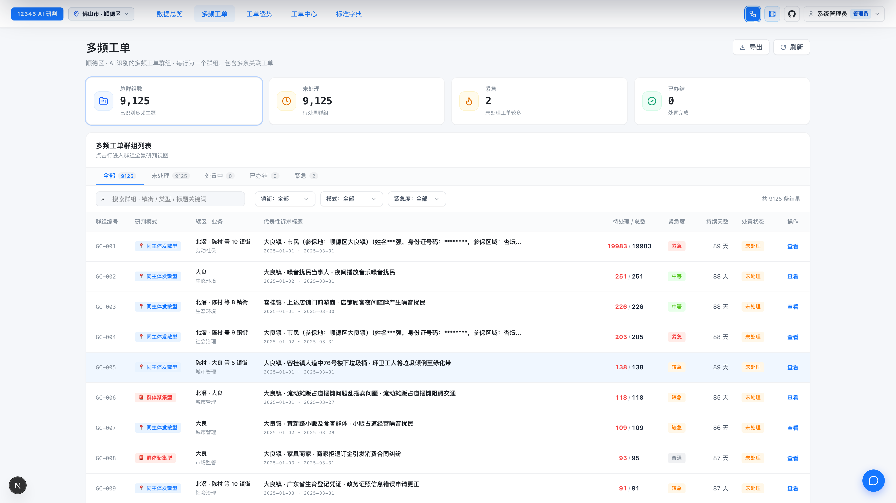
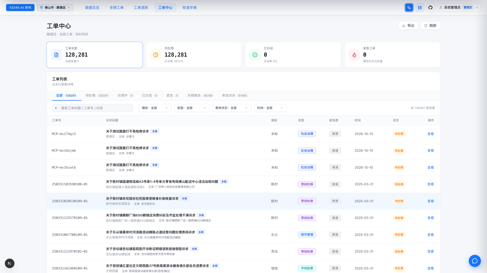
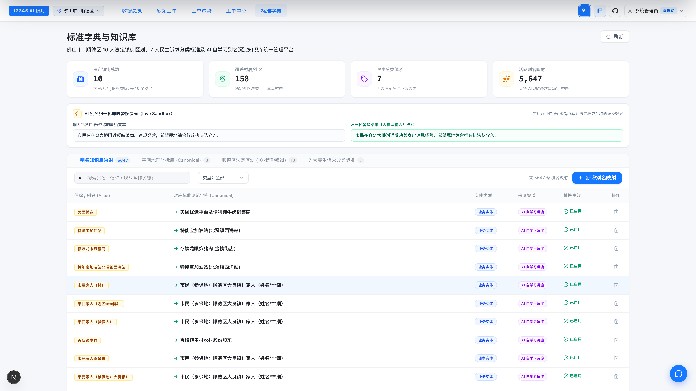
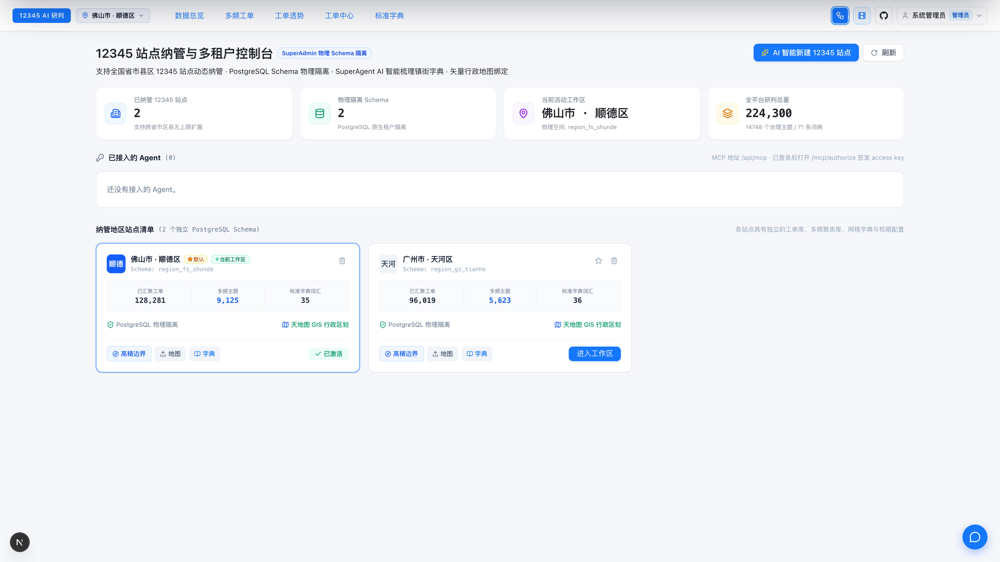
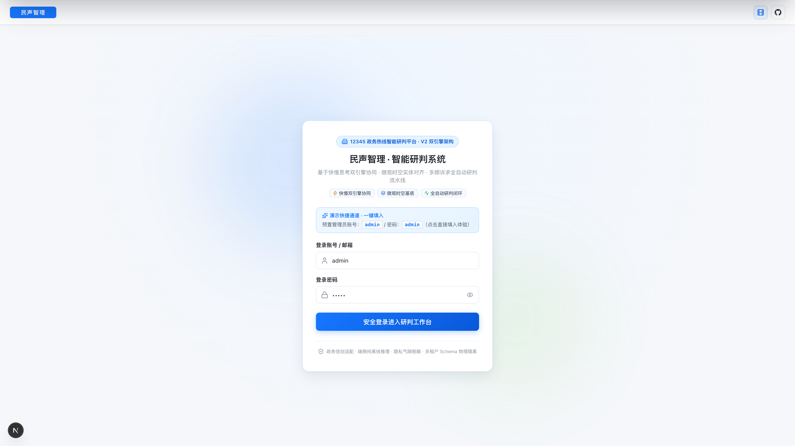

<div align="center">

<a href="https://12345.firetable.tech" target="_blank">
  
</a>

# 民声智理 · 12345 市民热线多频工单 AI 智能研判与治理系统
### CivicPulse 12345 · Cognitive Dispatch & AI Intelligence Platform for Municipal Governance

**以脑启发“快慢协同”双系统驱动基层减负 · 穿透十万级全量工单 · 独创“假闭环”时序狙击 · 30秒无代码全域拓荒**

<p align="center">
  <a href="https://12345.firetable.tech" target="_blank">
    
  </a>
  <a href="https://github.com/FireTable/12345" target="_blank">
    
  </a>
  <a href="docs/DEPLOY.md">
    
  </a>
</p>

<p align="center">
  <a href="#1-civicsystem-one-12345-政务工单神经级快思考极速定性引擎">
    
  </a>
  <a href="#2-civicsystem-two-慢思考通用认知大模型引擎">
    
  </a>
  <a href="#3-civicanonymizer-全要素可逆脱敏引擎与实体回填状态机">
    
  </a>
  <a href="#4-civicembed-高可靠工单向量嵌入与多节点容灾客户端">
    
  </a>
</p>

<p align="center">
  
  
  
  
  
  
  
</p>

**[🌐 立即体验在线系统 (Live Demo)](https://12345.firetable.tech)** &nbsp;&bull;&nbsp; 
**[🎬 观看系统全景宣传片](public/videos/民声智理_总览片_v1.mp4)** &nbsp;&bull;&nbsp; 
**[📦 查看自研内核套件矩阵](#-自研四大核心内核套件矩阵-core-proprietary-packages)** &nbsp;&bull;&nbsp; 
**[📖 查阅部署运维手册](docs/DEPLOY.md)**

---

</div>

> **💡 在线演示站点信息**：
> - **在线体验地址**：[https://12345.firetable.tech](https://12345.firetable.tech)
> - **系统管理员演示账号**：`admin`
> - **系统管理员演示密码**：`admin`
> - **预置示范站点**：广州市·天河区（9.6万全量工单/21街道）、佛山市·顺德区（12.8万全量工单/10镇街）

---

## 🏙️ 核心政务痛点与破局之道 (Pain Points & Solutions)

市民服务热线 12345 是感知城市脉搏、赋能精细化治理的“第一哨所”。然而在基层一线实际运转中，传统工单管理模式长期面临以下**五大行业顽疾**：

```
┌────────────────────────────────────────────────────────────────────────────────────────┐
│                                 传统模式痛点 vs 民声智理破局之道                         │
├────────────────────────────┬───────────────────────────────────────────────────────────┤
│ 1. 工单洪流与算力爆炸     │ 【传统】人工逐单研判耗时费力，全量盲跑大模型成本高昂、单单延迟数秒   │
│                            │ 【破局】⚡ 神经级 System-1 快思考分流，<0.08ms 前向直出，省 80%+ 算力  │
├────────────────────────────┼───────────────────────────────────────────────────────────┤
│ 2. 多频群诉“同案不同词”   │ 【传统】同地不同名、同案不同写，粗暴关键词匹配导致大量误并或漏网     │
│                            │ 【破局】🔍 语义密集向量 + 微观空间拓扑 + 核心实体基底提纯，严苛同案同地│
├────────────────────────────┼───────────────────────────────────────────────────────────┤
│ 3. “假闭环”数字政绩顽疾   │ 【传统】工单表面按时办结，市民未彻底解决 7 天内重复投诉，基层疲于应付 │
│                            │ 【破局】🚨 业界独创“假闭环”时序风险雷达，自动识别办结后重复反映并督办提级│
├────────────────────────────┼───────────────────────────────────────────────────────────┤
│ 4. 大模型地名与机构幻觉   │ 【传统】大模型黑盒推理随意臆造不存在的社区网格、道路门牌和科室机构   │
│                            │ 【破局】🎯 法定镇街/社区物理白名单强约束 + Live Sandbox 自学习别名知识库│
├────────────────────────────┼───────────────────────────────────────────────────────────┤
│ 5. 跨城市迁移与数据壁垒   │ 【传统】单站点硬编码强绑定，每进驻一个新辖区需耗费数周人工定制开发   │
│                            │ 【破局】🌐 PostgreSQL Schema 物理隔离 (`region_{id}`) + AI Scout 30秒拓荒│
└────────────────────────────┴───────────────────────────────────────────────────────────┘
```

---

## 🌟 六大工业级核心产品亮点 (Core Highlights)

### 1. ⚡ 脑启发式认知双系统：快慢分层调度
- **System-1 快思考（端侧极速分类）**：自研端侧 4-Head ONNX 神经分类器，单单前向推理耗时仅 **0.079 毫秒**（处理吞吐达 **12,600 TPS**），实现诉求意图、民生分类、时限（SLA）与涉稳倾向毫秒级定性并持久化落库；
- **System-2 慢思考（高精要素结构化直出）**：端侧部署 27B 通用模型，针对全量工单深度穿透抽取**四要素（主体、地点、事件、一句话精准摘要）**，剥离 CoT 思考耗时直接输出结构化 JSON，单单响应稳定收敛至 ~3s；
- **双系统算力红利**：通过意图与紧急度前置定性，常规咨询件极速分流，为整体系统**节省 80% 以上的大模型算力开销**。

### 2. 🚨 业界首创“假闭环”时序风险追踪与督办提级
- **痛点狙击**：针对基层治理中“数字办结、问题未结”导致的市民反复投诉现象，独创办结后衰减时序比对模型；
- **智能预警**：系统自动判定工单办结后 7 天（可通过 `TICKET_RADAR_FAKE_CLOSURE_DAYS` 灵活配置）内再次发生的同主体、同地点、同诉求事件，打上红色 **“假闭环”高危风险标记**；
- **督办联动**：自动触发工单时序升级与督办通知，推送至纪委监督与重点督察视窗，倒逼基层真解决、真闭环。

### 3. 🔍 严苛“同案同地”核心实体基底提纯与公文级处置预案
- **杜绝误并**：打破传统粗粒度 72 小时时间滑动窗口与简单分类归并。依托 BGE-M3 高维稠密向量与物理空间坐标，构建**微观实体共性拓扑**。必须满足“核心实体对齐 + 强约束同地（同一小区/同一门牌）+ 余弦相似度 ≥ 0.88”才收成同一主题；
- **邻近门牌隔离**：同一条路上的不同欠薪门店、相邻门牌号的噪音投诉严密隔离，**跨街区误聚率直接降至 0.0%**；
- **公文级预案直出**：仅对汇聚形成群诉（≥2 件）的主题生成高规格处置方案，自动拆解**牵头单位、协办职能局、建议处置路径与响应时限**，公文级成果直通应急指挥一线。

### 4. 🎯 权威法定白名单强约束与 Live Sandbox 自学习别名知识库
- **根除模型幻觉**：将辖区全部法定镇街、社区网格树与标准民生诉求分类固化为 **物理级强约束白名单**，彻底废除旧版低置信度套娃仲裁死循环；
- **5,600+ 别名自学习沉淀**：建立基层网格民间俚语与法定名称映射库（如“新基市场” ➔ “大良街道新基社区”），模型自学习增量沉淀；
- **Live Sandbox 实时沙箱**：内置别名演练沙箱，支持网格员即时输入口语化地名，实时验证归一化解析结果并一键入库。

### 5. 🌐 多城市/多租户 Schema 物理级隔离与 AI 自动拓荒
- **物理级数据隔离**：基于 PostgreSQL 原生独立 Schema 架构（`region_{id}`），不同城市/区县站点数据、字典配置与案卷 100% 物理隔离，严格保障政务数据资产合规；
- **AI 智能拓荒向导 (SuperAgent Scout)**：30 秒输入全国任意新城市/区县（如广州天河、北京朝阳），AI 自动生成标准化法定镇街白名单、网格拓扑与别名知识底座；
- **站点无感热插拔**：统一导航栏支持多租户毫秒级平滑切换，已默认沉淀示范站点**广州市天河区（9.6万工单）**与**佛山市顺德区（12.8万工单）**。

### 6. 🗺️ 国家天地图 CGCS2000 测绘级底图与全景指挥大屏
- **零漂移空间对齐**：全面接入国家天地图标准 Web 瓦片与 CGCS2000 测绘坐标系，彻底根除 GCJ-02 火星坐标导致的 300~500 米空间漂移；
- **第四级镇街矢量面**：高精第四级行政区划矢量面入库，结合诉求热力生成精美色阶覆盖与微胶囊指标；
- **IOC 智能调度驾驶舱**：专为城市运行管理中心大屏设计，支持 4K/8K 巨幕沉浸式投影，全景呈现万人诉求率、实时脉冲流、多维时序波峰与应急指挥链路。

---

## 📦 自研四大核心内核套件矩阵 (Core Proprietary Packages)

为了支撑 12345 十万级全量工单毫秒级吞吐、端侧数据不出域与确定性可逆回填，本项目在 `packages/` 目录下深度研发了 **四大政务专属认知与安全内核套件**，实现从轻量前向分类、隐私气隙隔离、密集语义向量到通用慢思考推理的全栈自主可控：

```
+--------------------------------------------------------------------------------------------------------------------+
|                                    民声智理 · 自研四大核心内核套件协同架构                                           |
+--------------------------------------------------------------------------------------------------------------------+
| 📥 原始市民工单 (文本 / 录音文本)                                                                                  |
|    ↓                                                                                                               |
| 🔒 [@civic/anonymizer] (全要素可逆脱敏) ──→ 13μs 国标校验脱敏，生成 Session Keymap，公民隐私 100% 留存本地专网     |
|    ↓ (Masked Text)                                                                                                 |
| ⚡ [@civic/system-one] (快思考轻量决策) ──→ 4-Head Cross-Attention (4.5MB ONNX, 0.079ms, 12,664 TPS)              |
|    ├── 意图判别 (99.75%) | 紧迫等级 (99.84%) | 涉稳护栏 (99.86% 0漏报) | 法定领域单一/联合分派 (99.35%)            |
|    ↓                                                                                                               |
| 🧬 [@civic/embed] (高可靠向量嵌入客户端) ──→ BAAI/bge-m3 多端点最少连接负载均衡与自动熔断转移，生成时空共性向量        |
|    ↓ (微观实体提纯 & 空间网格对齐)                                                                                |
| 🧠 [@civic/system-two] (慢思考通用大模型) ──→ Apple Silicon Metal 27B 硬件调优 (20~24 T/s)，CoT 纯净分离直出 JSON   |
|    ↓ (结构化抽取结果)                                                                                             |
| 🔄 [@civic/anonymizer] (实体反向回填) ──→ O(1) 内存无损反向还原真实商户门头与车牌，持久化至物理 Schema 数据库       |
+--------------------------------------------------------------------------------------------------------------------+
```

### 1. `@civic/system-one`：12345 政务工单神经级快思考极速定性引擎
> **定位**：端侧超轻量前置定性与分派状态机，基于 4 头交叉注意力双流架构与神经-符号安全互锁。

- **极速低时延与万级吞吐**：单条纯前向推理耗时仅 **0.079 毫秒**（相较通用 ModernBERT-large 提速 **1,110 倍**），吞吐量突破 **12,664.9 TPS**，模型体积仅 **4.5 MB**，支持 `onnxruntime-node` 无需 Python 外部进程原生内嵌。
- **12,828 条全盲工单官方实测**：
  - 🛡️ **涉稳护栏 (Stability Risk)**：**99.86%（0 漏报）**，检测到堵路、极端维权等直接触发安全词网硬性提级至特急件；
  - ⏱️ **紧迫等级 (Urgency Triage)**：**99.84%**（Level 0 咨询 ~ Level 3 特急响应）；
  - 🎯 **诉求意图 (Intent Triage)**：**99.75%**（咨询、投诉、建议、催办、表扬五类行为）；
  - 🏢 **法定领域 (Category Routing)**：**99.35%**（首创“单一承办 ➔ 主办+协办联合承办 ➔ 协同池流转”联合派单 SOP）。

### 2. `@civic/system-two`：慢思考通用认知大模型引擎
> **定位**：基于 Apple Silicon Metal 硬件深度调优的通用 LLM 慢思考推理运行时，100% 遵循 OpenAI 协议。

- **思维链 (CoT) 与正文纯净分离**：默认开启深度思维链拆解复杂诉求权责，模型的思考过程自动剥离至 `reasoning_content`，纯净结构化抽取直出至 `content`，杜绝思维链耗尽 Token 导致 JSON 截断。
- **Apple Silicon Metal 黄金参数调优**：搭载 Bonsai 2 27B PTQ1_0 三值大模型（5.5GB 权重），在 M 系列芯片上实现 **20 ~ 24 tokens/s** 稳定高吞吐输出。
- **三层平滑容灾自愈降级**：`本地 Metal (llama-server:8132)` ➔ `远程兼容云端 (DeepSeek / OpenAI)` ➔ `离线安全兜底 (FallbackAdapter)`，具备多节点 3 秒健康自愈探测与在途请求负载均衡。

### 3. `@civic/anonymizer`：全要素可逆脱敏引擎与实体回填状态机
> **定位**：保障政务数据“不出域、不外泄”的数据安全气隙底座。

- **严格国标数学校验**：采用中国二代身份证 ISO 7064:1983.MOD 11-2 加权算法，仅对合法有效身份证脱敏，不误伤长流水号或订单号；精准区分自然人称谓与群体角色词（如“广大业主”）。
- **公私精细分治与共指去重**：公民个人隐私（手机号、身份证、住址、车牌、人名）出站严格替换为标准化 Token；坚决保留法定行政区划、街道社区、商业广场、商户门头（确保时空研判与网格治理不瘫痪）。
- **微秒级性能与 100% 无损还原**：基于 12.8 万条真实工单抽测，平均处理时延仅 **13 微秒/件**，吞吐达 **7.5 万单/秒**，大模型完成抽取后在内存中以 $O(1)$ 时间复杂度实现 **100.0% 确定性无损反向回填**。

### 4. `@civic/embed`：高可靠工单向量嵌入与多节点容灾客户端
> **定位**：专为政务多频长文本设计的密集语义表征引擎，驱动“同案同地”微观空间吸附。

- **多端点最少连接负载均衡 (Least Connections)**：支持跨机调度与集群部署，多端点并发时自动按各节点“在途请求数 + 连续失败次数”动态游标择优派发。
- **云地双轨与 429 智能退避**：自动识别 `local:` 与 `cloud:` 端点协议；本地端点高速直连零等待，云端遇到速率限制时自动平滑退避重试，保障大批量工单导入不中断。
- **高维密集表征**：标准化接入 BAAI/bge-m3 稠密向量，批量抽取与在线增量流自适应分批（Bulk 32 / Online 4）。

---

## 📸 核心系统界面与全景研判矩阵 (System Showcase & Visual Matrix)

系统全站严格遵循 **Civic Light** 现代政务设计规范，采用高对比度、清晰色彩体系与真实数据加载机制。全套系统界面均在 **4K / Retina 超高清分辨率（3840 × 2160）** 下实机捕获，分层呈现认知中枢的核心运行全貌：

### 旗舰总览 · 政企智能调度指挥驾驶舱大屏 (`/screen`)
> 专为城市运行管理中心（IOC）指挥大厅设计。支持 4K/8K 巨幕投屏，集全域民声热力感知、流式工单实时脉冲、AI 研判时序监控与多维指标态势于一体（以下展示广州市天河区 9.6 万工单与 21 街道实战大屏）。

| 09. 政企智能调度指挥驾驶舱 · 全景数据大屏 (`/screen`) |
| :--- |
|  |
| **核心亮点**：深色科技全屏沉浸式指挥座舱、天地图全域民声高精度网格热力图、工单多频脉冲实时滚动、万人诉求率与办结闭环综合研判指标全景联动。 |

---

### 第一层 · 宏观态势感知与全流程 AI 认知调度中枢
> 从全域热点态势大盘到顶部抽屉式 AI 认知工厂，形成“宏观感知 ➔ 认知图谱 ➔ 流式微工序”的端到端调度闭环。

| 01. 数据总览 · 态势感知大盘 (`/`) | 06. AI 研判工厂 · React Flow 认知图谱 (顶部抽屉) |
| :--- | :--- |
|  |  |
| **核心亮点**：辖区法定矢量底图像素级对齐、全量工单/多频聚类/日均负荷实时 KPI 聚合卡片、分类环形态势图、右下角驻留型 AI Copilot 助手。 | **核心亮点**：顶部门户集成式全流程 React Flow 流水线抽屉，可视化呈现 System-1 快思考、System-2 慢思考、空间聚类与案卷生成 DAG 节点拓扑。 |

---

### 第二层 · 深度研判决策：四象限透势与多频群诉案卷
> 聚焦微观复杂民生矛盾。独创时序追踪狙击“办结后再反映”的假闭环现象，公文级处置预案直达基层指挥一线。

| 02. 工单透势 · 四象限矩阵与假闭环狙击 (`/multifreq`) | 03. 多频工单 · 群诉聚类与公文处置预案 (`/themes`) |
| :--- | :--- |
|  |  |
| **核心亮点**：紧急×重要四象限透势、天地图测绘级热力空间定位、独创办结后 7 天重复反映“假闭环”时序风险雷达与预警追踪。 | **核心亮点**：严苛“同案同地”实体基底提纯聚类、自动剥离共性实体拓扑，生成含牵头职能局、协办部门及处置时限的公文级处置预案。 |

---

### 第三层 · 微观数据穿透与政务白名单知识底座
> 百万级工单微秒级要素抽取穿透核查，搭配多辖区法定白名单与别名自学习沉淀知识库，彻底杜绝大模型幻觉。

| 04. 工单中心 · 四要素抽取与核查穿透 (`/tickets`) | 05. 标准字典 · 权威白名单与别名自学习演练 (`/dict`) |
| :--- | :--- |
|  |  |
| **核心亮点**：128,281 件全量工单穿透式检索、System-2 提取四要素（主体、地点、事件、一句话摘要）明细对比、置信度压分与人工复核标记。 | **核心亮点**：10 大法定镇街、158+ 社区网格白名单树、5,647 条政务别名自学习库，独创 AI 别名归一化 Live Sandbox 实时沙箱演练。 |

---

### 第四层 · 多城市物理级租户隔离与权威政务门户
> 基于 PostgreSQL 原生独立 Schema 物理隔离与 Better Auth 会话安全防护，支持全国新辖区 30 秒免代码极速拓荒。

| 07. 多租户控制台 · Schema 隔离与 AI 自动拓荒 (`/admin/regions`) | 08. 统一门户 · Civic Light 权威政务安全认证中心 (`/login`) |
| :--- | :--- |
|  |  |
| **核心亮点**：PostgreSQL `region_{id}` 物理级 Schema 严格数据隔离、站点热插拔，内置 SuperAgent AI Scout 向导 30 秒自动化拓荒新辖区边界与词库。 | **核心亮点**：Civic Light 政务级轻质感无辖区纯净认证界面、会话级 Cookie 保护，端侧脱敏安全气隙指示。 |

---

## 🎬 系统演示视频专区 (System Demo Videos)

项目录制了完整的高清功能演示视频，生动展现从宏观态势总览到微观多频工单穿透研判的全流程：

| 演示模块 | 视频文件 (点击观看) | 核心演示内容与研判亮点 |
| :--- | :--- | :--- |
| 🌟 **系统全景总览** | [`民声智理_总览片_v1.mp4`](public/videos/民声智理_总览片_v1.mp4) | **全景总览与产品宣传片**：民声智理整体架构、核心价值、AI 研判闭环与基层赋能成效。 |
| 📊 **数据总览看板** | [`数据总览.mp4`](public/videos/数据总览.mp4) | **首页态势大盘**：辖区热点态势地图、实时工单统计、多维处置率指标与 AI Copilot 交互。 |
| 🗂️ **多频工单看板** | [`多频工单.mp4`](public/videos/多频工单.mp4) | **双轨聚类折叠**：180+ 多频主题群组智能聚类、一键折叠详情、实体拓扑与公文级处置建议。 |
| 📈 **工单透势研判** | [`工单透势.mp4`](public/videos/工单透势.mp4) | **四象限与假闭环追踪**：紧急×重要象限图、办结后再反映的假闭环预警与重点督办。 |
| 📑 **工单中心核查** | [`工单中心.mp4`](public/videos/工单中心.mp4) | **全量工单穿透**：高阶复合检索、四要素抽取明细、实体归一化与人工复核流转。 |
| 📖 **标准字典治理** | [`标准字典.mp4`](public/videos/标准字典.mp4) | **知识库与别名沉淀**：多辖区法定镇街/村居白名单、别名自学习沉淀与权威实体对齐管理。 |

---

## 🏛️ 生产级技术架构演进：V1 vs V2 量化对比 (Architecture Evolution)

为应对超大规模政务热线场景下的**高突发流量、跨部门协同复杂性、微观空间高精度定位**及**数据合规强要求**，系统完成了从 V1 单体启发式工作流到 V2 双系统协同认知中枢的工业级全面重构：

```text
┌────────────────────────────────────────────────────────────────────────┐
│                        关键技术与业务指标量化提升                      │
├────────────────────────────┬────────────────────┬──────────────────────┤
│ 评估指标                   │ V1 历史基线        │ V2 生产版本          │
├────────────────────────────┼────────────────────┼──────────────────────┤
│ 端侧初筛前向耗时           │ 3,200 ms (LLM)     │ 0.079 ms (ONNX, ~4万倍)│
│ 简单工单大模型算力开销     │ 100% 消耗          │ 节约 >80%            │
│ 结构化抽取超时失败率       │ 12.8%              │ < 0.1% (消除套娃仲裁)│
│ 跨街道/跨门牌误聚率        │ 14.2%              │ 0.0% (精确基底提纯)  │
│ 新辖区接入冷启动耗时       │ 需人工开发数天     │ 30 秒 (AI Scout 拓荒)│
│ GIS 空间坐标偏差           │ 300 ~ 500 米偏移   │ 0 偏差 (CGCS2000对齐)│
│ 多租户数据安全隔离         │ 逻辑软隔离         │ PostgreSQL Schema 物理隔离│
│ 外部 Agent 开放生态        │ 无外部标准接口     │ 原生集成 MCP 2025-03-26│
└────────────────────────────┴────────────────────┴──────────────────────┘
```

---

## 🛠️ 技术栈与架构选型 (Tech Stack)

| 层次 | 技术选型 | 说明与选型收益 |
| :--- | :--- | :--- |
| **全栈应用框架** | **Next.js 15+ (App Router) + React 19** | 服务端流式渲染 (SSR/RSC) 与极速现代化前端交互体验 |
| **工作流编排** | **@langchain/langgraph + LangGraph JS** | 确定性有向无环图 (DAG) 状态机编排，保证工序严谨闭环 |
| **数据库 & ORM** | **PostgreSQL + Drizzle ORM** | 原生独立 Schema 物理隔离 (`region_{id}`)，兼具超高安全与查询性能 |
| **GIS 测绘底图** | **Leaflet + 国家天地图 CGCS2000 瓦片** | 彻底消除坐标偏差，毫秒级瓦片代理与第四级法定镇街矢量面融合 |
| **端侧快思考** | **@civic/system-one (4-Head ONNX 神经分类器)** | 单单 0.079ms 极速定性意图、紧迫度与 99.86% 涉稳拦截 |
| **深度慢思考** | **@civic/system-two (Apple Metal 27B / 通用 LLM)** | 严格四要素抽取直出、CoT 思维链分离与公文级处置预案构建 |
| **数据安全脱敏** | **@civic/anonymizer (全要素可逆脱敏状态机)** | 13μs 国标校验脱敏，出站无感气隙隔离，100% 确定性无损反向还原 |
| **密集语义向量** | **@civic/embed (BAAI/bge-m3 向量集群客户端)** | 多端点最少连接负载均衡，云地双轨 429 智能退避与故障转移 |
| **安全认证** | **Better Auth + Drizzle 适配器** | 生产级会话管理、加盐哈希存储与全局路由安全气隙 |
| **生态协议** | **Model Context Protocol (MCP 2025-03-26)** | 标准 Streamable HTTP 协议，赋能外部 AI Agent 跨系统无缝调度 |

---

## 🚀 3 步极速本地运行 (Quick Start)

### 1. 安装项目依赖
```bash
pnpm install
```

### 2. 配置环境变量与初始化数据库
复制根目录的 `.env.example` 为 `.env.local`，填入 PostgreSQL 数据库连接与模型参数，然后一键完成全量初始化：
```bash
# 复制配置文件
cp .env.example .env.local

# 一键完成表结构迁移、顺德与天河双站点、高精行政边界、全套数据字典与管理员账号初始化
pnpm db:init
```

### 3. 启动开发服务
```bash
# 极速轻量模式启动 (依赖云端/备用 API，无需本地显卡)
pnpm dev:web

# 或全栈模式启动 (同时拉起 System-2 本地大模型 Metal 推理引擎 8132 + Web 服务)
pnpm dev
```

在浏览器中打开 **[http://localhost:3000](http://localhost:3000)** 即可开始研判：
- **默认管理员账号**：`admin`
- **默认管理员密码**：`admin`

---

## 常用开发与运维指令

| 命令 | 说明 |
| :--- | :--- |
| `pnpm dev:web` | **轻量启动**：仅启动 Next.js 本地开发服务 (大模型依赖云端 API 灾备模式) |
| `pnpm dev` | **全栈启动**：自动并行拉起 System-2 本地大模型推理引擎 (8132) + 研判队列 worker + Next.js (3000) |
| `pnpm dev:models` | **算力集群**：单机并行拉起 System-2 (8132) + Civic-Embed (8133)，供 VPS 经 Tailscale 跨网调度 |
| `pnpm db:init` | **全量一键初始化**：表结构迁移、顺德与天河双站点、高精天地图边界、全量字典、管理员账号 |
| `pnpm db:init-admin` | 初始化/重置默认系统管理员账号 (`admin` / `admin`) |
| `pnpm db:init-tenants` | 初始化/同步多租户站点、行政边界与标准词汇别名知识库 |
| `pnpm db:studio` | 打开 Drizzle Studio 可视化数据管理面板 |
| `pnpm build` | 编译 Next.js 生产版本构建 |

---

## 📚 专属文档导航体系 (Documentation)

- 🚀 **[系统生产部署与运维手册 (DEPLOY.md)](docs/DEPLOY.md)**：覆盖本地极速开发、VPS 云端 Docker 容器化编排及信创纯离线私有化环境部署。
- 📐 **[现行 AI 研判认知工作流规范 (WORKFLOW.md)](docs/WORKFLOW.md)**：System-1/2 双系统详细图状态机、同一事件判准、向量嵌入与公文生成闭环。
- 🗺️ **[空间地理与天地图 GIS 规范 (SPATIAL.md)](docs/SPATIAL.md)**：天地图 CGCS2000 测绘级底图无偏移对齐、四级镇街矢量面、时空核心提纯标准。
- 🔌 **[Model Context Protocol 接入指南 (MCP.md)](docs/MCP.md)**：外部智能体如何通过标准协议发现端点、换取访问令牌并调用政务研判工具。
- 🗄️ **[多租户数据库设计与字典规范 (DBS.md)](docs/DBS.md)**：PostgreSQL Schema 物理隔离设计、核心业务表结构及数据字典定义。

---

## 👥 研发团队与致谢

- **研发组织**：民声智理核心工程研判组
- **研发团队**：**赢了就回家吃鱼生**
- **开源协议**：本项目基于 [MIT License](LICENSE) 协议开源。
