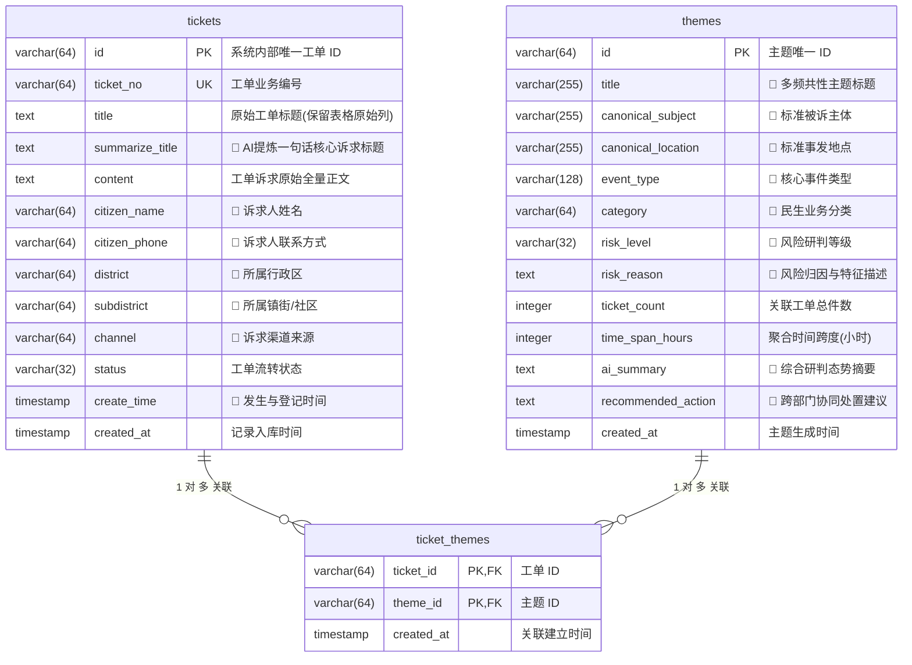
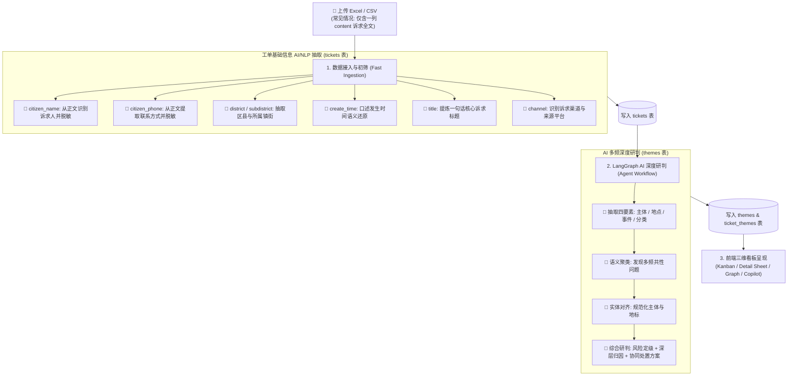

# 数据库表结构与字段字典 (Database Schema & Dictionary)

本项目（民声智理 · 顺德 12345 AI 智能研判系统）使用 **Drizzle ORM** 进行模型定义与数据访问，底层数据模型由 **3 张核心数据表** 组成。

> 💡 **核心设计原则（全文本 AI 语义解构）**：
> 实际政务工单（12345/热线）数据中，原始表格往往只有一列长文本 `content`（诉求正文），包含“市民李某某（138xxxx）于某年某月在某区某街道反映某单位某问题……”。
> - 描述前带有 **🤖** 的字段，表示该字段支持由 **AI 大模型（LLM Agent / LangGraph 节点）或 NLP 语义抽取算法** 深度扫描 `content` 正文后自动识别、提炼与回填。
> - 系统优先读取表格中已有的显式列；若表格缺失分列或仅提供正文长文本，则**全量由 AI 自动解析填充**。

---

## 一、数据表关系总览 (ER Diagram)

---

## 二、数据表详细字段字典

### 1. 工单主表：`tickets` (`ticketsTable`)
> 存储工单全生命周期基础记录。当输入数据仅包含 `content` 诉求正文时，AI 会全自动对正文进行实体抽取并回填各维度。

| 字段名 (`Column`) | 数据库类型 | 约束 | 字段描述 | 数据来源 / AI 抽取逻辑 |
| :--- | :--- | :--- | :--- | :--- |
| `id` | `VARCHAR(64)` | `PRIMARY KEY` | 工单唯一系统主键 ID | 系统在入库时按 `tk-{timestamp}-{index}` 自动生成 |
| `ticket_no` | `VARCHAR(64)` | `NOT NULL, UNIQUE, INDEX` | 工单业务编号 | 优先读取表格编号列；若无独立列，从正文提取单号或生成唯一业务序列号 |
| `title` | `TEXT` | `NULLABLE` | **原始工单诉求标题** | **严格保留原始表格的标题列**，完全不做任何覆盖与篡改，保障数据保真度与审计溯源 |
| `summarize_title` | `TEXT` | `NULLABLE` | 🤖 **AI 提炼核心诉求标题** | **由 AI 从 `content` 中自动提炼概括**出的一句话标准诉求摘要（如 `“关于xx街道xx路夜间餐饮油烟排放扰民诉求”`） |
| `content` | `TEXT` | `NOT NULL` | 工单诉求原始全量文本 | **核心数据源**，承载市民诉求所有细节（时间、地点、涉事方、人物、诉求诉点） |
| `citizen_name` | `VARCHAR(64)` | `NULLABLE` | 🤖 **诉求市民姓名** | 优先读取表格列；若表格无独立列，**由 AI/NLP 从 `content` 中识别抽取**诉求人称谓（如“李女士”、“张先生”），并支持自动合规脱敏 |
| `citizen_phone` | `VARCHAR(64)` | `NULLABLE` | 🤖 **诉求人联系电话** | 优先读取表格列；若表格无独立列，**由 AI/正则从 `content` 中识别抽取**电话号码，并自动进行掩码脱敏（如 `138****1234`） |
| `district` | `VARCHAR(64)` | `NULLABLE` | 🤖 **所属行政区划** | 表格无独立列时，**由 AI/地理语义解析模块从 `content` 识别抽取**所属区县（如“海淀区”、“福田区”） |
| `subdistrict` | `VARCHAR(64)` | `INDEX, NULLABLE` | 🤖 **所属镇街 / 社区辖区** | 表格无独立列时，**由 AI/行政区划语义模块从 `content` 动态识别提取**所属镇街（如“xx街道”、“xx镇”、“xx社区”），支撑网格化分派 |
| `channel` | `VARCHAR(64)` | `DEFAULT '市民服务热线'` | 🤖 **诉求来源渠道** | 优先读取表格列；若无独立列，**由 AI 从 `content` 或前缀识别**渠道特征（如“市民服务热线”、“微信小程序”、“微信公众号”、“市长信箱”等） |
| `status` | `VARCHAR(32)` | `DEFAULT 'PENDING'` | 工单流转状态 | 标识工单处理进度（`PENDING` 待研判 / `PROCESSING` 处理中 / `RESOLVED` 已办结） |
| `create_time` | `TIMESTAMP` | `INDEX, NULLABLE` | 🤖 **诉求登记 / 发生时间** | 优先读取表格列；若无独立时间列，**由 AI/时序解析引擎从 `content` 口述文本中精准还原**发生时间（如从 `“昨天下午3点半”` 或 `“2025年3月12日 14:30”` 还原标准时间戳） |
| `created_at` | `TIMESTAMP` | `NOT NULL, DEFAULT NOW` | 系统入库时间戳 | 数据库插入时自动记录 |

---

### 2. 多频主题聚类表：`themes` (`themesTable`)
> 存储经 LangGraph AI 智能体完成多频共性聚类、四要素规范化、风险定级与协同方案生成的研判成果。

| 字段名 (`Column`) | 数据库类型 | 约束 | 字段描述 | 数据来源 / AI 生成逻辑 |
| :--- | :--- | :--- | :--- | :--- |
| `id` | `VARCHAR(64)` | `PRIMARY KEY` | 聚类主题唯一 ID | 系统按 `thm-{timestamp}-{index}` 自动分配 |
| `title` | `VARCHAR(255)` | `NOT NULL` | 🤖 **多频共性问题主题标题** | **由 LangGraph 聚类/总结节点 (LLM)** 综合多条工单的矛盾共性提炼的聚合主题名称（如 `“某某广场周边流动摊贩占道经营与油烟扰民问题”`） |
| `canonical_subject` | `VARCHAR(255)` | `NOT NULL, INDEX` | 🤖 **标准被诉主体 / 责任单位** | **由 Extract/Canonical 节点 (LLM)** 从正文中统一对齐的标准实体名称（如某物业公司、某烧烤店、某建设工程部） |
| `canonical_location` | `VARCHAR(255)` | `NOT NULL` | 🤖 **标准发生地点 / 地标** | **由 Extract/Canonical 节点 (LLM)** 消除表述差异后提炼的标准地理位置（精确到街道/路段/小区） |
| `event_type` | `VARCHAR(128)` | `NOT NULL` | 🤖 **核心事件类型提炼** | **由 Extract 节点 (LLM)** 高度概括的标准化事件类型（如 `“夜间营业音响喧哗与商业噪音扰民”`） |
| `category` | `VARCHAR(64)` | `DEFAULT '综合民生'` | 🤖 **民生业务归属分类** | **由 AI 研判模型** 自动归类（如 `市容秩序`、`生态环保`、`住建管理`、`市场监管`、`公共安全`、`交通出行`、`综合民生`） |
| `risk_level` | `VARCHAR(32)` | `NOT NULL, INDEX, DEFAULT 'LOW'` | 🤖 **多频风险等级评定** | **由 Summary 节点 (LLM)** 结合投诉频次、诉求集中度、矛盾激化风险综合裁定（`HIGH` 高危 / `MEDIUM` 中危 / `LOW` 低危） |
| `risk_reason` | `TEXT` | `NULLABLE` | 🤖 **深层风险成因与归因分析** | **由 Summary 节点 (LLM)** 综合研判生成的成因剖析（包含矛盾根源、群众反响程度、是否涉及群体性隐患等） |
| `ticket_count` | `INTEGER` | `NOT NULL, DEFAULT 0` | 聚类关联工单总件数 | 统计归纳到该主题下的底层工单总量（聚合统计） |
| `time_span_hours` | `INTEGER` | `NOT NULL, DEFAULT 1` | 工单爆发时间跨度（小时） | 基于关联工单的最大发生时间与最小发生时间差动态计算 |
| `ai_summary` | `TEXT` | `NULLABLE` | 🤖 **多频态势 AI 综合研判简报** | **由 Summary 节点 (LLM)** 生成的高层研判综述，总结集中爆发的时段规律与核心诉求点 |
| `recommended_action` | `TEXT` | `NULLABLE` | 🤖 **跨部门协同处置建议与方案** | **由 Summary 节点 (LLM)** 生成的针对性处置策略（包含牵头部门、联合执法机制、源头治理策略） |
| `created_at` | `TIMESTAMP` | `NOT NULL, DEFAULT NOW` | 主题生成入库时间 | 聚类流程执行完毕入库时自动生成 |

---

### 3. 工单-主题多对多关联表：`ticket_themes` (`ticketThemesTable`)
> 维护底层工单与聚类主题的对应关系，支持看板点击卡片下钻明细、全量核查与知识图谱关联。

| 字段名 (`Column`) | 数据库类型 | 约束 | 字段描述 | 数据来源 / 生成逻辑 |
| :--- | :--- | :--- | :--- | :--- |
| `ticket_id` | `VARCHAR(64)` | `PRIMARY KEY (复合), FK -> tickets.id (CASCADE), INDEX` | 关联的工单系统主键 ID | 聚类算法计算完成后自动写入 |
| `theme_id` | `VARCHAR(64)` | `PRIMARY KEY (复合), FK -> themes.id (CASCADE), INDEX` | 关联的多频主题 ID | 聚类算法计算完成后自动写入 |
| `created_at` | `TIMESTAMP` | `NOT NULL, DEFAULT NOW` | 关联建立时间戳 | 关联建立时自动记录 |

---

## 三、全生命周期 AI 赋能与抽取路径矩阵

---

## 四、AI 抽取字段对照汇总表

| 目标表名 | 字段名称 | 抽取目标 | AI / NLP 处理方式 | 解决的业务痛点 |
| :--- | :--- | :--- | :--- | :--- |
| **`tickets`** | `citizen_name` | 诉求人称谓 | 🤖 NER/正则识别姓名并掩码 | 表格无单列诉求人时，自动提取诉求主体 |
| **`tickets`** | `citizen_phone` | 诉求人电话 | 🤖 正则/模型识别手机座机并掩码 | 自动提取联系电话，保障数据合规脱敏 |
| **`tickets`** | `district` | 所属行政区 | 🤖 地理实体提取 | 自动补充区划信息，支撑行政区宏观统计 |
| **`tickets`** | `subdistrict` | 所属镇街/社区 | 🤖 镇街网格实体识别 | 精确定位责任街道，赋能网格化协同下派 |
| **`tickets`** | `create_time` | 事发时间 | 🤖 时序语义解析引擎 | 还原市民口述发生时间，支持精准时序态势分析 |
| **`tickets`** | `summarize_title` | 诉求摘要标题 | 🤖 核心语义概括 | 自动生成一句话高清诉求标题，避免原标题简略或缺失 |
| **`tickets`** | `channel` | 诉求渠道 | 🤖 渠道文本识别 | 识别热线、小程序、公众号等多渠道来源 |
| **`themes`** | `title` | 主题标题 | 🤖 LLM 概括提炼 | 自动生成通俗精准的共性事件标题 |
| **`themes`** | `canonical_subject` | 标准被诉主体 | 🤖 LLM 实体规范对齐 | 统一简称与一企多名（如“xx大排档”与“xx烧烤”） |
| **`themes`** | `canonical_location` | 标准发生地点 | 🤖 LLM 地理规范化 | 统一具体门牌与地标表述 |
| **`themes`** | `event_type` | 核心事件类型 | 🤖 LLM 语义抽象 | 提炼标准政务事件分类 |
| **`themes`** | `category` | 民生业务分类 | 🤖 AI 分类研判 | 按照市容、环保、住建等领域自动分流 |
| **`themes`** | `risk_level` | 风险等级评定 | 🤖 LLM 态势风险定级 | 智能评估群体性、紧急性风险（高/中/低） |
| **`themes`** | `risk_reason` | 风险归因分析 | 🤖 LLM 深度剖析 | 深度挖掘群众矛盾根源与管理盲区 |
| **`themes`** | `ai_summary` | 综合态势研判 | 🤖 LLM 态势简报生成 | 一键生成领导决策简报与态势总结 |
| **`themes`** | `recommended_action` | 协同处置建议 | 🤖 LLM 处置方案生成 | 给出牵头部门、联合执法与长效治理方案 |
