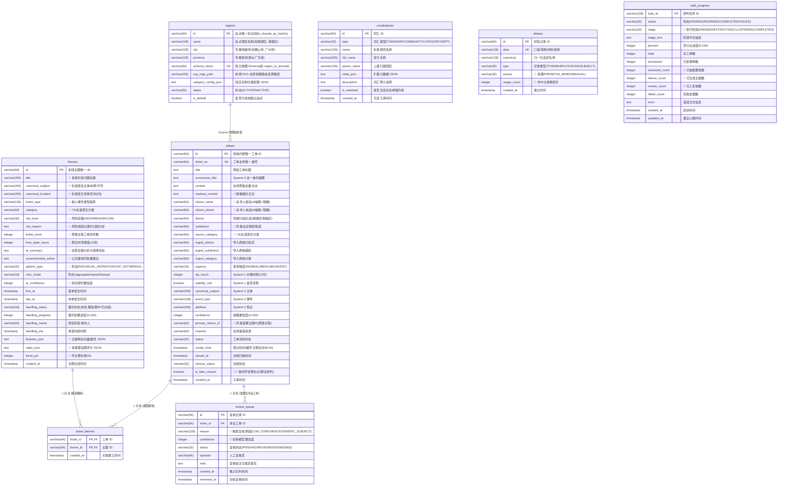

# 数据库表结构与字段字典 (Database Schema & Dictionary)

> **项目名称**：民声智理 · 12345 政务热线认知中枢与 AI 智能研判系统 (多城市 / 多租户 V2 生产架构)  
> **参赛团队**：赢了就回家吃鱼生  
> **ORM 框架**：Drizzle ORM (`drizzle-orm` + `postgres.js`)  
> **数据库引擎**：PostgreSQL 16 (支持多租户独立 Schema 物理隔离 / JSONB / 时区时间戳 / 高并发索引)

---

## 目录
1. [数据表关系拓扑 (ER Diagram)](#一数据表关系拓扑-er-diagram)
2. [多城市独立 Schema 物理隔离体系](#二多城市独立-schema-物理隔离体系)
3. [8 大核心数据表详细字典](#三8-大核心数据表详细字典)
   - [0. 区域/站点注册花名册表 (regions - public schema)](#0-区域站点注册花名册表-regions---public-schema)
   - [1. 工单主表 (tickets)](#1-工单主表-tickets-ticketstable)
   - [2. 多频主题聚类表 (themes)](#2-多频主题聚类表-themes-themestable)
   - [3. 工单-主题关联表 (ticket_themes)](#3-工单-主题多对多关联表-ticket_themes-ticketthemestable)
   - [4. 人工复核队列 (review_queue)](#4-人工复核队列-review_queue-reviewqueuetable)
   - [5. 官方标准政务词汇表 (vocabularies)](#5-官方标准政务词汇表-vocabularies-vocabulariestable)
   - [6. 别名与实体对齐知识库 (aliases)](#6-别名与实体对齐知识库-aliases-aliasestable)
   - [7. 任务进度持久化表 (task_progress)](#7-任务进度持久化表-task_progress-taskprogresstable)
4. [数据库脚本与运维常用命令](#四数据库脚本与运维常用命令)

---

## 一、数据表关系拓扑 (ER Diagram)



---

## 二、多城市独立 Schema 物理隔离体系

为了支持全国范围内多城市/多区县站点的无感热插拔与严格数据安全隔离，系统采用 **PostgreSQL 独立 Schema 物理隔离** 架构：

```text
PostgreSQL 实例 (ticket_radar)
├── public (公共元数据空间)
│   ├── regions (区域/站点注册花名册表)
│   ├── user / session / account (Better Auth 全局认证表)
│   └── ...
├── region_fs_shunde (佛山市顺德区物理 Schema)
│   ├── tickets / themes / ticket_themes / review_queue / vocabularies / aliases / task_progress
├── region_gz_haizhu (广州市海珠区物理 Schema)
│   ├── tickets / themes / ticket_themes / review_queue / vocabularies / aliases / task_progress
└── region_{id} (任意新城市 AI 拓荒独立 Schema)
    └── 100% 物理独立表结构，杜绝跨辖区数据串扰
```

- **动态路由**：应用通过 `getRegionDb(regionId)` 或 `lib/tenant/schema-manager.ts` 动态解析目标站点 Schema，自动执行独立迁移与隔离查询；
- **AI 拓荒**：通过 `/admin/regions` 调用 Scout 拓荒 Agent，30 秒完成新城市法定区划分析、建表与知识沉淀。

---

## 三、8 大核心数据表详细字典

### 0. 区域/站点注册花名册表：`regions` (`regionsTable` in `public` schema)
> 存储全局已注册的城市/区县站点信息、独立 Schema 映射名与前端态势地图资源。

| 字段名 | 数据库类型 | 约束 / 索引 | 描述 | 数据来源 / 算法说明 |
| :--- | :--- | :--- | :--- | :--- |
| `id` | `VARCHAR(64)` | `PRIMARY KEY` | 站点唯一标识符 | 如 `fs_shunde`, `gz_haizhu`, `bj_chaoyang` |
| `name` | `VARCHAR(128)` | `NOT NULL` | 站点行政区全名 | 如 `顺德区`, `海珠区` |
| `city` | `VARCHAR(128)` | `NOT NULL, INDEX` | 所属地级市 | 如 `佛山市`, `广州市`, `北京市` |
| `province` | `VARCHAR(128)` | `NOT NULL, DEFAULT '广东省'` | 所属省份 | 如 `广东省` |
| `schema_name` | `VARCHAR(64)` | `NOT NULL, UNIQUE, INDEX` | 对应的独立物理 Schema | 如 `region_fs_shunde`, `region_gz_haizhu` |
| `svg_map_path`| `VARCHAR(255)` | `NULLABLE` | 前端 SVG 态势地图资源路径 | 如 `/civic/shunde-map.svg`，支持热插拔 |
| `category_config_json` | `TEXT` | `NULLABLE` | 定制民生分类配置 JSON | 支持各辖区个性化扩展民生诉求分类 |
| `status` | `VARCHAR(32)` | `NOT NULL, INDEX, DEFAULT 'ACTIVE'` | 站点运营状态 | `ACTIVE` 启用 / `INACTIVE` 维护停用 |
| `is_default` | `BOOLEAN` | `NOT NULL, DEFAULT FALSE` | 是否为系统全局默认站点 | 默认站点为 `true` (如佛山顺德示范站点) |
| `description`| `TEXT` | `NULLABLE` | 站点业务说明备注 | 站点特性、数据量及管理主体备忘 |
| `created_at` | `TIMESTAMP` | `NOT NULL, DEFAULT NOW` | 站点创建入库时间 | 站点注册时间戳 |
| `updated_at` | `TIMESTAMP` | `NOT NULL, DEFAULT NOW` | 站点信息更新时间 | 站点元数据更新时间戳 |

---

### 1. 工单主表：`tickets` (`ticketsTable`)
> 存储工单全生命周期基础记录，承载原始诉求、🤖 AI 结构化抽取字段、脱敏正文及 🚨 假闭环研判标签。

| 字段名 | 数据库类型 | 约束 / 索引 | 描述 | 数据来源 / 算法说明 |
| :--- | :--- | :--- | :--- | :--- |
| `id` | `VARCHAR(64)` | `PRIMARY KEY` | 工单唯一系统主键 ID | 系统按 `tk-{timestamp}-{index}` 自动分配 |
| `ticket_no` | `VARCHAR(64)` | `NOT NULL, UNIQUE, INDEX` | 12345 业务工单编号 | `250101000770102-01`：前六位年月日，接着六位受理序号，末三位事项代码，横杠后是重办序号 |
| `title` | `TEXT` | `NULLABLE` | 表格里的短标签 | 已经是分类过的标签，例如「（城管）商业噪音」。市民原文在 `content`，标题可空 |
| `summarize_title` | `TEXT` | `NULLABLE` | 这一条工单的摘要 | System 2 为这一条写的一句话。抽不出来就空着 |
| `content` | `TEXT` | `NOT NULL` | 工单原始诉求全文 | 核心数据源（含事发时间、地点、涉事方、诉求细节） |
| `masked_content` | `TEXT` | `NULLABLE` | 🤖 隐私脱敏展示文本 | 经 `anonymizer.ts` 对人名、手机、门牌等关键 PII 掩码后的安全文本 |
| `citizen_name` | `VARCHAR(64)` | `NULLABLE` | 🤖 诉求人姓名 | 🤖 结构化抽取并做脱敏掩码（如 `张*`） |
| `citizen_phone` | `VARCHAR(64)` | `NULLABLE` | 🤖 诉求人联系电话 | 🤖 结构化抽取并做脱敏掩码（如 `138****1234`） |
| `district` | `VARCHAR(64)` | `NULLABLE` | 所属行政区划 | 归属行政区划（如“顺德区”、“海珠区”） |
| `subdistrict` | `VARCHAR(64)` | `INDEX, NULLABLE` | 法定镇街 | 当前城市词典里的法定镇或街道。模型返回的 `UNKNOWN` 不入库，对不上就空着 |
| `source_category` | `VARCHAR(64)` | `INDEX, NULLABLE` | 民生分类 | System 1。城市管理/市场监管/社会治理/交通出行/生态环境/劳动社保/公共安全 |
| `ingest_district` | `VARCHAR(64)` | `NULLABLE` | 导入原始行政区 | 导入文件原始区划字段（未经 AI 处理） |
| `ingest_subdistrict` | `VARCHAR(64)` | `NULLABLE` | 导入原始镇街 | 导入文件原始镇街字段（未经 AI 处理） |
| `ingest_category` | `VARCHAR(64)` | `NULLABLE` | 导入原始诉求分类 | 导入文件原始分类字段（未经 AI 处理） |
| `urgency` | `VARCHAR(16)` | `INDEX, DEFAULT 'NORMAL'` | 紧急程度 | System 1。`NORMAL` / `MEDIUM` / `URGENT`。涉稳或紧急程度为 3 时写成 `URGENT` |
| `sla_hours` | `INTEGER` | `NULLABLE` | 办理时限（小时） | System 1。紧急程度 0 到 3 对应 0、120、24、2 |
| `stability_risk` | `BOOLEAN` | `NULLABLE` | 是否涉稳 | System 1。`false` 也是有效结果 |
| `canonical_subject` | `VARCHAR(255)` | `NULLABLE` | 主体 | System 2。最长 255 字 |
| `event_type` | `VARCHAR(128)` | `NULLABLE` | 事件 | System 2。最长 128 字 |
| `address` | `VARCHAR(255)` | `NULLABLE` | 地点 | System 2 抽出的事发地点 |
| `confidence` | `INTEGER` | `NULLABLE` | 抽取置信度 (0~100) | 低于 60 进入人工复核队列。不再为此再叫一次大模型。主体抽空时上限压到 55。主体、地点的 `null` 在校验前收成空字符串 |
| `primary_theme_id` | `VARCHAR(64)` | `INDEX, NULLABLE` | 🤖 首要归属主题 ID | 🤖 聚类后关联的核心多频群组 ID |
| `channel` | `VARCHAR(64)` | `DEFAULT '市民服务热线'` | 诉求来源渠道 | 市民热线 / 微信小程序 / 市长信箱 |
| `status` | `VARCHAR(32)` | `INDEX, DEFAULT 'PENDING'` | 流转状态 | `PENDING` 待研判 / `PROCESSING` 处置中 / `RESOLVED` 已结案 |
| `create_time` | `TIMESTAMP WITH TIME ZONE` | `INDEX, NULLABLE` | 登记时间 | 编号前六位对应的日期，记亚洲/上海当天 00:00。例如 `250101…` 为 `2025-01-01 00:00+08`。编号不是日期时，才用正文里的时间 |
| `closed_at` | `TIMESTAMP` | `INDEX, NULLABLE` | 办结归档时间 | 业务系统反馈的结案时间戳 |
| `closure_status` | `VARCHAR(32)` | `NULLABLE` | 办结结论状态 | `已办结` / `处理中` / `退单` |
| `is_fake_closure` | `BOOLEAN` | `DEFAULT FALSE` | 假闭环 | 同一件事在办结后 7 天内再次反映时置为 `true`。天数由 `TICKET_RADAR_FAKE_CLOSURE_DAYS` 控制 |
| `created_at` | `TIMESTAMP` | `NOT NULL, DEFAULT NOW` | 入库时间 | 记录创建时间 |

---

### 2. 多频主题聚类表：`themes` (`themesTable`)
> 两条及以上、被判定为同一件事或同一个具体地点的工单，收成一个主题。单独留下的工单不进这张表。

| 字段名 | 数据库类型 | 约束 / 索引 | 描述 | 数据来源 / 算法说明 |
| :--- | :--- | :--- | :--- | :--- |
| `id` | `VARCHAR(64)` | `PRIMARY KEY` | 多频主题唯一 ID | 系统按 `thm-{timestamp}-{index}` 自动分配 |
| `title` | `VARCHAR(255)` | `NOT NULL` | 🤖 多频共性问题标题 | 🤖 由 Summary 节点概括的共性治理主题 |
| `canonical_subject` | `VARCHAR(255)` | `NOT NULL, INDEX` | 🤖 标准责任主体 | 🤖 100% 字符对齐的主体（如特定车牌号、商铺字号） |
| `canonical_location` | `VARCHAR(255)` | `NOT NULL` | 🤖 标准发生空间位置 | 🤖 微观空间拓扑聚合的标准点位（如具体小区/门牌） |
| `event_type` | `VARCHAR(128)` | `NOT NULL` | 🤖 核心事件类型 | 🤖 抽象标准业务事件（如“夜间餐饮油烟排放与排风机噪音”） |
| `category` | `VARCHAR(64)` | `DEFAULT '城市管理'` | 🤖 7大标准民生分类 | 🤖 城市管理/市场监管/社会治理/交通出行/生态环境/劳动社保/公共安全 |
| `risk_level` | `VARCHAR(32)` | `NOT NULL, INDEX, DEFAULT 'LOW'` | 🤖 风险研判等级 | 🤖 `HIGH` 红色高危 / `MEDIUM` 黄色中危 / `LOW` 蓝色常规 |
| `risk_reason` | `TEXT` | `NULLABLE` | 🤖 风险归因与激化分析 | 🤖 包含诉求集中度、矛盾激化因素、群体性隐患剖析 |
| `ticket_count` | `INTEGER` | `NOT NULL, INDEX, DEFAULT 0`| 🤖 聚合工单总件数 | 🤖 该多频群组下包含的工单数 |
| `time_span_hours` | `INTEGER` | `NOT NULL, DEFAULT 1` | 🤖 爆发时间跨度 (小时) | 🤖 最大与最小发生时间的间隔 |
| `ai_summary` | `TEXT` | `NULLABLE` | 🤖 态势全貌分析摘要 | 🤖 高层研判简报，总结集中爆发的时段规律与核心诉求 |
| `recommended_action`| `TEXT` | `NULLABLE` | 主题处置建议 | 只写给已收成主题的多条工单。System 2 思考关掉。模型没写出就空着，不用同一句套话填上 |
| `pattern_type` | `VARCHAR(32)` | `INDEX, NULLABLE` | 🤖 聚类形态分类 | 🤖 `INDIVIDUAL_REPEAT` (主体重复) / `GROUP_GATHERING` (群体聚集) |
| `civic_mode` | `VARCHAR(16)` | `NULLABLE` | 主题形态 | `aggregate` 群体聚集 / `repeat` 同一人反复 / `diverge` 同一地点多类问题。由成团方式算出，不是二次仲裁 |
| `ai_confidence` | `INTEGER` | `NULLABLE` | 🤖 研判置信度评分 | 🤖 综合质检置信度得分 (0~100) |
| `first_at` / `last_at`| `TIMESTAMP` | `NULLABLE` | 首末单发生时间 | 群组内最早及最新工单登记时间 |
| `handling_status` | `VARCHAR(16)` | `DEFAULT '未处理'` | 全周期督办状态 | `未处理` / `处置中` / `已办结` |
| `handling_progress`| `INTEGER` | `DEFAULT 0` | 督办进度百分比 | 0 ~ 100 整数进度 |
| `handling_owner` | `VARCHAR(64)` | `NULLABLE` | 牵头承办责任科室 | 如“所属镇街综合行政执法办” |
| `handling_eta` | `TIMESTAMP` | `NULLABLE` | 承诺办结时限 | 督办截止时限要求 |
| `features_json` | `TEXT` | `NULLABLE` | 🤖 特征向量/属性 JSON | 🤖 聚类多维特征序列化字段 |
| `radar_json` | `TEXT` | `NULLABLE` | 🤖 多维雷达图评分 JSON | 🤖 诉求复杂度、影响面、解决难度等多维雷达打分 |
| `trend_pct` | `INTEGER` | `NULLABLE` | 🤖 环比爆发增长率 (%) | 🤖 相比历史基线的激化增长百分比 |
| `created_at` | `TIMESTAMP` | `NOT NULL, DEFAULT NOW` | 主题生成时间 | 记录创建时间戳 |

---

### 3. 工单-主题多对多关联表：`ticket_themes` (`ticketThemesTable`)

| 字段名 | 数据库类型 | 约束 / 索引 | 描述 |
| :--- | :--- | :--- | :--- |
| `ticket_id` | `VARCHAR(64)` | `PRIMARY KEY (复合), FK -> tickets.id (CASCADE), INDEX` | 关联的底层工单 ID |
| `theme_id` | `VARCHAR(64)` | `PRIMARY KEY (复合), FK -> themes.id (CASCADE), INDEX` | 关联的多频主题 ID |
| `created_at` | `TIMESTAMP` | `NOT NULL, DEFAULT NOW` | 关联建立时间戳 |

---

### 4. 人工复核队列：`review_queue` (`reviewQueueTable`)
> 抽取置信度低于 60，或抽取失败的工单进这里，由人看。不再为此再叫一次大模型。

| 字段名 | 数据库类型 | 约束 / 索引 | 描述 |
| :--- | :--- | :--- | :--- |
| `id` | `VARCHAR(64)` | `PRIMARY KEY` | 复核记录主键 ID |
| `ticket_id` | `VARCHAR(64)` | `NOT NULL, FK -> tickets.id (CASCADE), INDEX` | 关联的争议工单 ID |
| `reason` | `VARCHAR(128)`| `NOT NULL, DEFAULT 'LOW_CONFIDENCE'` | 🤖 触发复核原因（如低置信度、虚词主体、跨区冲突） |
| `confidence`| `INTEGER` | `NULLABLE` | 🤖 首轮模型给出的置信度 |
| `status` | `VARCHAR(32)` | `NOT NULL, INDEX, DEFAULT 'PENDING'` | 复核状态 (`PENDING` 待审 / `REVIEWED` 已修正 / `DISMISSED` 忽略) |
| `operator` | `VARCHAR(64)` | `NULLABLE` | 承办复核员工号/姓名 |
| `note` | `TEXT` | `NULLABLE` | 人工批注与仲裁意见 |
| `created_at`| `TIMESTAMP` | `NOT NULL, DEFAULT NOW` | 推入队列时间 |
| `reviewed_at`| `TIMESTAMP`| `NULLABLE` | 人工复核完成时间 |

---

### 5. 官方标准政务词汇表：`vocabularies` (`vocabulariesTable`)
> 严格固化当前辖区法定镇街、村居社区与 7 大民生分类白名单（内置顺德等预置字典），作为 Prompt 强约束输入。

| 字段名 | 数据库类型 | 约束 / 索引 | 描述 |
| :--- | :--- | :--- | :--- |
| `id` | `VARCHAR(64)` | `PRIMARY KEY` | 词汇唯一 ID |
| `type` | `VARCHAR(32)` | `NOT NULL, INDEX` | 类别：`TOWNSHIP` 镇街 / `COMMUNITY` 村居 / `CATEGORY` 分类 / `DEPARTMENT` 部门 |
| `name` | `VARCHAR(128)`| `NOT NULL, INDEX` | 标准名称（如辖区镇街名、民生分类名） |
| `full_name`| `VARCHAR(255)`| `NULLABLE` | 官方全称（如 `XX区XX街道办事处`） |
| `parent_name`|`VARCHAR(128)`| `NULLABLE` | 上级归属辖区（如所属镇街名） |
| `meta_json` | `TEXT` | `NULLABLE` | 扩展元数据 JSON（如辖区边界、人口、负责人等） |
| `description`| `TEXT` | `NULLABLE` | 词汇释义与权责说明 |
| `is_standard`|`BOOLEAN` | `NOT NULL, DEFAULT TRUE` | 是否为法定白名单强约束 |
| `created_at`| `TIMESTAMP` | `NOT NULL, DEFAULT NOW` | 词汇录入时间 |

---

### 6. 别名与实体对齐知识库：`aliases` (`aliasesTable`)
> 口语俗称与法定称谓映射表，支持运行期大模型自动挖掘与异步自学习沉淀。

| 字段名 | 数据库类型 | 约束 / 索引 | 描述 |
| :--- | :--- | :--- | :--- |
| `id` | `VARCHAR(64)` | `PRIMARY KEY` | 别名映射唯一 ID |
| `alias` | `VARCHAR(128)`| `NOT NULL, UNIQUE, INDEX` | 市民口语俗称/简称（如 `容奇`、`桂洲`、`德胜新区`） |
| `canonical`| `VARCHAR(128)`| `NOT NULL, INDEX` | 对应的法定权威标准名（如 `容桂街道`、`大良街道`） |
| `type` | `VARCHAR(32)` | `NOT NULL, INDEX, DEFAULT 'ENTITY'` | 实体类型 (`TOWNSHIP` / `LOCATION` / `SUBJECT`) |
| `source` | `VARCHAR(32)` | `NOT NULL, DEFAULT 'PRESET'` | 🤖 沉淀来源 (`PRESET` 预置 / `AI_MINED` AI自学习 / `MANUAL` 手工维护) |
| `usage_count`|`INTEGER` | `NOT NULL, DEFAULT 0` | 🤖 匹配与替换命中累计计数 |
| `created_at`| `TIMESTAMP` | `NOT NULL, DEFAULT NOW` | 创建时间 |

---

### 7. 任务进度持久化表：`task_progress` (`taskProgressTable`)
> 记录 LangGraph 图工作流异步执行状态与前端实时进度推送。

| 字段名 | 数据库类型 | 约束 / 索引 | 描述 |
| :--- | :--- | :--- | :--- |
| `task_id` | `VARCHAR(128)`| `PRIMARY KEY` | 异步研判任务 ID (`task-cluster-{timestamp}`) |
| `status` | `VARCHAR(32)` | `NOT NULL, INDEX, DEFAULT 'PENDING'` | 任务状态 (`PENDING` / `RUNNING` / `COMPLETED` / `FAILED`) |
| `stage` | `VARCHAR(32)` | `NOT NULL, DEFAULT 'EXTRACTING'` | 🤖 执行阶段 (`PARSING` / `EXTRACTING` / `CLUSTERING` / `SYNTHESIZING` / `COMPLETED`) |
| `stage_text`| `TEXT` | `NOT NULL, DEFAULT '准备就绪'` | 前端实时展示的中文阶段提示 |
| `percent` | `INTEGER` | `NOT NULL, DEFAULT 0` | 当前百分比进度 (0~100) |
| `total` | `INTEGER` | `NOT NULL, DEFAULT 0` | 待处理工单总数 |
| `processed`| `INTEGER` | `NOT NULL, DEFAULT 0` | 已完成处理单数 |
| `extracted_count`| `INTEGER` | `NOT NULL, DEFAULT 0` | 🤖 已完成要素抽取单数 |
| `theme_count`|`INTEGER` | `NOT NULL, DEFAULT 0` | 🤖 当前已挖掘出主题数 |
| `review_count`|`INTEGER`| `NOT NULL, DEFAULT 0` | 🤖 推入复核队列的工单数 |
| `failed_count`|`INTEGER`| `NOT NULL, DEFAULT 0` | 处理失败单数 |
| `error` | `TEXT` | `NULLABLE` | 异常报错详细信息 |
| `created_at`| `TIMESTAMP` | `NOT NULL, DEFAULT NOW` | 任务创建启动时间 |
| `updated_at`| `TIMESTAMP` | `NOT NULL, INDEX, DEFAULT NOW`| 最近心跳更新时间 |

---

### 8. 用户与认证体系表 (Better Auth Security Schema)
> 生产级用户认证与会话状态持久化表体系。

#### (1) 用户信息表：`user` (`userTable`)
| 字段名 | 数据库类型 | 约束 | 描述 |
| :--- | :--- | :--- | :--- |
| `id` | `TEXT` | `PRIMARY KEY` | 用户唯一标识 UUID |
| `name` | `TEXT` | `NOT NULL` | 用户姓名/昵称（如 `系统管理员`） |
| `email` | `TEXT` | `NOT NULL, UNIQUE` | 登录邮箱/主标识 |
| `email_verified`| `BOOLEAN` | `NOT NULL, DEFAULT false` | 邮箱是否已校验 |
| `image` | `TEXT` | `NULLABLE` | 用户头像 URL |
| `role` | `TEXT` | `NOT NULL, DEFAULT 'user'` | 权限角色 (`admin` / `user` / `operator`) |
| `username` | `TEXT` | `UNIQUE, NULLABLE` | 用户名标识 (如 `admin`) |
| `created_at` | `TIMESTAMP` | `NOT NULL, DEFAULT NOW` | 创建时间 |
| `updated_at` | `TIMESTAMP` | `NOT NULL, DEFAULT NOW` | 更新时间 |

#### (2) 会话表：`session` (`sessionTable`)
| 字段名 | 数据库类型 | 约束 | 描述 |
| :--- | :--- | :--- | :--- |
| `id` | `TEXT` | `PRIMARY KEY` | 会话唯一 ID |
| `expires_at` | `TIMESTAMP` | `NOT NULL` | 会话过期时间戳 |
| `token` | `TEXT` | `NOT NULL, UNIQUE` | Session Token 密钥 |
| `ip_address` | `TEXT` | `NULLABLE` | 客户端登录 IP |
| `user_agent` | `TEXT` | `NULLABLE` | 客户端浏览器 User-Agent |
| `user_id` | `TEXT` | `NOT NULL, REFERENCES user(id)` | 关联用户 ID (级联删除) |
| `created_at` | `TIMESTAMP` | `NOT NULL, DEFAULT NOW` | 创建时间 |
| `updated_at` | `TIMESTAMP` | `NOT NULL, DEFAULT NOW` | 更新时间 |

#### (3) 账号凭据表：`account` (`accountTable`)
| 字段名 | 数据库类型 | 约束 | 描述 |
| :--- | :--- | :--- | :--- |
| `id` | `TEXT` | `PRIMARY KEY` | 凭据唯一 ID |
| `account_id` | `TEXT` | `NOT NULL` | 凭据提供商内部账号 ID |
| `provider_id` | `TEXT` | `NOT NULL` | 认证提供商 (`credential` / `username` 等) |
| `user_id` | `TEXT` | `NOT NULL, REFERENCES user(id)` | 关联用户 ID (级联删除) |
| `password` | `TEXT` | `NULLABLE` | 加密哈希密码 (scrypt/bcrypt 密文) |
| `issuer` | `TEXT` | `NULLABLE` | 认证颁发者 |
| `created_at` | `TIMESTAMP` | `NOT NULL, DEFAULT NOW` | 创建时间 |
| `updated_at` | `TIMESTAMP` | `NOT NULL, DEFAULT NOW` | 更新时间 |

---

## 四、数据库脚本与运维常用命令

| 业务目标 | 对应 NPM 命令 | 底层脚本路径 | 说明 |
| :--- | :--- | :--- | :--- |
| **全量一键初始化** | `pnpm db:init` | `scripts/db-init.ts` | 一键执行表迁移、顺德/天河双站点注册、天地图高精边界、数据字典、管理员账号 |
| **管理员账号初始化** | `pnpm db:init-admin` | `scripts/init-admin.ts` | 初始化/重置默认系统管理员账号 (`admin` / `admin`) |
| **多租户站点拓荒** | `pnpm db:init-tenants` | `scripts/init-tenants.ts` | 初始化/重置顺德与天河 Schema、高精边界及标准字典 |
| **数据库迁移** | `pnpm db:migrate` | `scripts/db-migrate.ts` | 执行 `db/migrations/` 下的 SQL 迁移脚本 |
| **词库同步** | `pnpm db:vocab` | `scripts/seed-vocabulary.ts` | 导入辖区法定镇街、村居及预置别名知识库 |
| **数据备份导出** | `pnpm db:export` | `scripts/db-export.ts` | 导出全库数据为 `db/dumps/ticket_radar_data.json` |
| **数据离线恢复** | `pnpm db:import` | `scripts/db-import.ts` | 从 json dump 快速全量恢复库数据 |
| **清空业务表** | `pnpm db:clear` | `scripts/db-clear.ts` | 安全清空工单与主题数据（保留多租户站点与字典配置） |
| **Drizzle Studio** | `pnpm db:studio` | `drizzle-kit studio` | 启动本地可视化数据库管理控制台 (Port 4983) |
