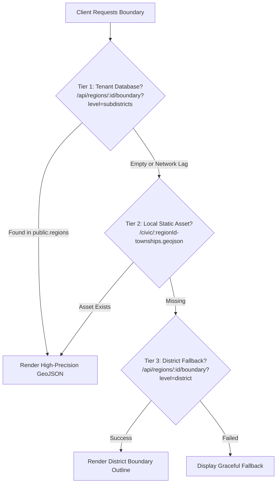

# CivicRadar Spatial & Geo-Location Architecture Guide

> **Civic Intelligence (民声智理) · 12345 Public Hotline Cognitive Engine & AI Workflow**  
> Spatial computing, multi-tier administrative division mesh, and zero-drift GIS visualization standards.

---

## Table of Contents
1. [Executive Summary](#1-executive-summary)
2. [Multi-Tier Spatial Data Hierarchy](#2-multi-tier-spatial-data-hierarchy)
3. [Coordinate Reference Systems (CRS) & Pixel-Perfect Alignment](#3-coordinate-reference-systems-crs--pixel-perfect-alignment)
4. [Front/Back Separation Architecture for GIS](#4-frontback-separation-architecture-for-gis)
5. [Geo-Location in the AI Agent Pipeline](#5-geo-location-in-the-ai-agent-pipeline)
6. [Visualization & UX Ergonomics Standards](#6-visualization--ux-ergonomics-standards)
7. [API & Data Schema Reference](#7-api--data-schema-reference)

---

## 1. Executive Summary

CivicRadar does not treat geographic maps as static UI decorations. Instead, spatial data is treated as an **active dimension of incident reasoning and operational routing**:

- **Incident-to-Grid Binding**: Translates unstructured conversational citizen reports into structured geographic coordinates and official 4th-level subdistrict grids (镇街/网格).
- **Spatial Semantic Clustering**: Merges micro-spatial entity proximity with LangGraph embeddings to identify localized recurring incident clusters (多频高发群组).
- **High-Performance Vector Visualization**: Provides subdistrict-level choropleths, centroid micro-badges, and zero-jank interactive filtering with full multi-tenant region switching.

---

## 2. Multi-Tier Spatial Data Hierarchy

### 2.1 Fourth-Level Administrative Polygon Mesh (Subdistricts)
Traditional municipal systems often stop at the 3rd administrative tier (District/County level, e.g., 顺德区 or 天河区). CivicRadar standardizes on the **4th statutory administrative level** (Township/Subdistrict level, e.g., 大良街道, 容桂街道, 猎德街道):

- **Shunde District (`fs_shunde`)**: 10 official townships / subdistricts.
- **Tianhe District (`gz_tianhe`)**: 21 official subdistricts.

### 2.2 Canonical Asset Naming Convention
All geographic boundary datasets follow the strict prefixed format in `/public/civic/`:
- `fs_shunde-townships.geojson` (Foshan Shunde Subdistrict Mesh)
- `gz_tianhe-townships.geojson` (Guangzhou Tianhe Subdistrict Mesh)

### 2.3 Three-Tier Resilient Fallback Strategy
To guarantee 100% rendering uptime regardless of database state or cold starts, boundary resolution employs a 3-tier cascade:



---

## 3. Coordinate Reference Systems (CRS) & Pixel-Perfect Alignment

### 3.1 The Coordinate Drift Problem in China
In the Chinese GIS ecosystem, map layers and GeoJSON often diverge across three incompatible coordinate standards:

| Coordinate System | Authority / Platform | Characteristics | Non-linear Encryption Shift |
|---|---|---|---|
| **WGS-84 / CGCS2000** | National Geomatics Center of China (Tianditu), Gov GeoJSON | Standard geodetic ellipsoid | **0 meters (True Coordinates)** |
| **GCJ-02 ("Mars Coordinates")** | AutoNavi (Amap), Google China, Tencent | Obfuscated via national algorithm | **300m ~ 500m offset** |
| **BD-09** | Baidu Maps | Secondary obfuscation on top of GCJ-02 | **400m ~ 800m offset** |

### 3.2 Resolution: Strict CGCS2000 Alignment
CivicRadar strictly aligns its GeoJSON boundaries with **Tianditu CGCS2000 base layers**:
- Vector boundary coordinates and Tianditu raster tiles use the identical spatial reference.
- **Zero offset**: Rivers, highways, bridges, and subdistrict boundaries align down to the individual pixel.

---

## 4. Front/Back Separation Architecture for GIS

```
┌────────────────────────────────────────────────────────────┐
│                    Client Browser (Leaflet)                 │
└──────┬─────────────────────────────────────────────┬───────┘
       │                                             │
       │ ① Map Raster Tiles (High-frequency images)   │ ② Administrative Boundaries & Geocoding
       │   Cached locally via HTTP Disk Cache        │   (Low-frequency business data)
       ▼                                             ▼
┌────────────────────────────┐               ┌────────────────────────────┐
│    Tianditu / Tile Proxy    │               │  Next.js Server Backend    │
│  (256x256 WMTS Png Layers) │               │  (/api/regions, /api/map)  │
└────────────────────────────┘               └─────────────┬──────────────┘
                                                           │
                                                           │ ③ TIANDITU_SERVER_KEY
                                                           ▼
                                             ┌────────────────────────────┐
                                             │ Tianditu National API Gate │
                                             │ (Reverse Geocoding / POIs) │
                                             └────────────────────────────┘
```

1. **Map Tile Delivery**:
   - Vector and annotation tiles are requested through `/api/map/tile?type=vec` and `/api/map/tile?type=cva`.
   - The backend proxy injects statutory user-agent headers and enforces `Cache-Control: public, max-age=604800` (7 days).
   - Once fetched, tiles are served entirely from the client browser's **`disk cache`**, resulting in **zero ongoing compute or network overhead** on the application server.
2. **Backend Key Security**:
   - `TIANDITU_SERVER_KEY` is maintained exclusively within server-side environment variables (`.env.local`, `.env.vps`) and is never exposed in client bundles or network inspection.

---

## 5. Geo-Location in the AI Agent Pipeline

Spatial intelligence directly feeds the LangGraph multi-stage graph pipeline:

### 5.1 Spatial Core Cleansing (`extractSpatialCore`)
Raw citizen descriptions frequently contain erratic micro-suffixes:
- `"大良街道金榜上街28号门前沿街商铺"` ➔ Cleansed to: **`"大良街道金榜上街"`**
- `"容桂文武路某烧烤档夜间占道"` ➔ Cleansed to: **`"容桂文武路"`**

By stripping away room numbers, floor levels, and generic suffixes while preserving road, neighborhood, and village cores, the system ensures high-quality clustering keys.

### 5.2 Reverse Township Imputation (`legalTownshipName`)
When a citizen ticket omits explicit subdistrict metadata:
1. The AI pipeline evaluates the spatial description against canonical landmark and community dictionaries in `lib/vocabulary.ts`.
2. References such as `"清晖园门前"` or `"太古汇北门"` automatically map to their statutory subdistricts (**大良街道** and **天河南街道**).
3. Tickets without geographic markers remain unassigned rather than being assigned arbitrary defaults.

### 5.3 Anti-Hallucination Barrier (`isSameSpatialEntity`)
To prevent over-clustering:
- Distinct road sections within the same town are evaluated as distinct spatial nodes.
- Administrative-level generalities (e.g., merging all `"大良街道"` tickets into one) are strictly blocked by `RULES.adminOnlyLocation`.

---

## 6. Visualization & UX Ergonomics Standards

1. **Single Source of Truth (SSOT) Palette**:
   - Township colors are centrally derived via `getTownshipColor(name)` in `lib/civic-cluster.ts`.
   - The exact same color corresponds to a given subdistrict across GIS choropleth maps, ticket tables, trend charts, and vocabulary administration settings.
2. **Centroid Micro-Badge Anchoring**:
   - Dynamic HTML markers that drift during zoom have been eliminated.
   - The `[Township Name · Ticket Count]` pill is permanently bound to the polygon's geometric centroid.
3. **Zero-Jank Interaction**:
   - Selecting a township highlights the polygon and filters the dashboard while **preserving the exact viewport and zoom level**.
   - `vector-effect: non-scaling-stroke !important;` prevents stroke explosion artifacts during map zooms.

---

## 7. API & Data Schema Reference

### 7.1 Database Schema Additions (`public.regions`)
```sql
ALTER TABLE public.regions
  ADD COLUMN IF NOT EXISTS geojson_boundary text,      -- District Level Boundary
  ADD COLUMN IF NOT EXISTS subdistricts_geojson text;   -- 4th-Level Subdistrict Mesh
```

### 7.2 Core Endpoints
| Method | Route | Description |
|---|---|---|
| `GET` | `/api/regions/:id/boundary?level=subdistricts` | Retrieves 4th-level subdistrict polygon mesh |
| `GET` | `/api/regions/:id/boundary?level=district` | Retrieves 3rd-level district outline polygon |
| `POST` | `/api/map/geocode` | Bi-directional geocoding & subdistrict reverse lookup |
| `GET` | `/api/map/tile?type=vec&z=:z&x=:x&y=:y` | High-speed cached Tianditu vector raster tile proxy |
| `GET` | `/api/map/tile?type=cva&z=:z&x=:x&y=:y` | High-speed cached Tianditu annotation tile proxy |
