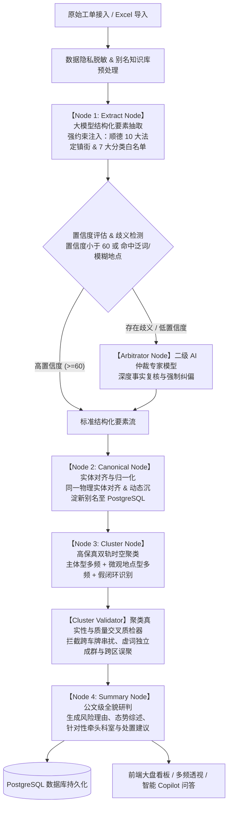

# 顺德区 12345 热线智能工单研判平台 · AI 工作流全景架构文档

本文档详细阐述顺德区 12345 热线智能工单管理平台中 **AI Agent 工作流（基于 LangGraph 图工作流 + PostgreSQL 权威知识库 + 规则引擎）** 的端到端执行链路、架构拓扑、节点职责与保真质检机制。

---

## 一、工作流整体架构与拓扑图



---

## 二、端到端核心节点详细说明

### 1. 数据隐私脱敏与别名预处理（Pre-Processing）
- **文件与模块**：[`backend/anonymizer.ts`](../backend/anonymizer.ts)、[`lib/alias-dict.ts`](../lib/alias-dict.ts)
- **核心逻辑**：
  1. **敏感信息掩码**：市民真实姓名（`张*`）、手机号（`138****0000`）、身份证号自动打码，确保大模型交互符合政务数据合规标准。
  2. **别名规范化替换**：在工单文本入模前，扫描已知俗称/旧称/地标缩写（如 `容奇/桂洲` $\to$ `容桂街道`、`德胜新区` $\to$ `大良街道`、`碧桂园总部` $\to$ `北滘镇`），执行全局边界安全替换，避免产生叠字后缀。

---

### 2. 大模型结构化要素抽取（Extract Node）
- **文件与模块**：[`backend/node/extract-node.ts`](../backend/node/extract-node.ts)、[`backend/prompt.ts`](../backend/prompt.ts)、[`lib/vocabulary.ts`](../lib/vocabulary.ts)
- **核心逻辑**：
  - **白名单强约束**：系统 Prompt 严格注入顺德区 10 大法定镇街（大良、容桂、伦教、勒流、陈村、北滘、乐从、龙江、杏坛、均安）及 7 大民生诉求业务分类（城市管理、市场监管、社会治理、交通出行、生态环境、劳动社保、公共安全），**彻底杜绝大模型凭空捏造不存在的行政区划**。
  - **Zod 结构化抽取字段**：
    - `summarizeTitle`：12-25 字高清公文标题（如 *关于容桂街道扁滘富豪路三街2号粤ESD221违停挪车诉求*）。
    - `subject`：精确被诉具体对象/责任主体（精确到具体车牌号 `粤ESD221车辆`、商铺字号 `招财宝民宿`，严禁“车主/商家”等泛词）。
    - `location`：精准微观地点（法定镇街 + 路段/巷号 + 门牌/小区）。
    - `eventType`：8-15 字政务标准问题定性。
    - `category`：严格限定 7 大业务分类之一。
    - `confidence`：0-100 抽取质量综合置信度得分。
  - **受控并发与进度回传**：采用 `p-queue` 控制模型并发调用，实时向前端推送当前处理百分比与抽取进度。

---

### 3. 低置信度二级 AI 仲裁与事实消歧（Arbitrator Node）
- **文件与模块**：[`backend/node/arbitrator-node.ts`](../backend/node/arbitrator-node.ts)
- **触发条件**：
  1. 首轮抽取综合置信度 `< 60`；
  2. 涉事主体命中泛化虚词（“车主”、“小车”、“商家”、“某单位”、“当事人”等）；
  3. 事发地点未明确或无法在法定镇街词汇表中锚定。
- **仲裁逻辑**：
  - 调用二级专家大模型（采用更低 `temperature: 0.0` 及深度事实复核 Prompt）；
  - 结合原始工单正文与权威词汇表，进行深层消歧纠偏；
  - 修正后重新计算置信度；若仍无法确认，自动打标推入 `review_queue` 人工复核队列。

---

### 4. 实体对齐与别名自学习沉淀（Canonical Node）
- **文件与模块**：[`backend/node/canonical-node.ts`](../backend/node/canonical-node.ts)、[`db/schema.ts`](../db/schema.ts)
- **核心逻辑**：
  1. **同一物理实体识别**：
     - 车牌号实体严格隔离：车牌完全一致才可对齐；
     - 商户字号前缀对齐：多工单同一商户的不同写法（如“招财宝客栈”与“招财宝民宿”）统一合并至最具代表性的规范全称。
  2. **知识库自学习沉淀**：
     - 新挖掘出的高置信度别名，自动异步写入 PostgreSQL `aliasesTable`，实现一次学习、全局生效。

---

### 5. 高保真双轨聚类与假闭环识别（Cluster Node）
- **文件与模块**：[`backend/node/cluster-node.ts`](../backend/node/cluster-node.ts)、[`backend/node/fake-closure.ts`](../backend/node/fake-closure.ts)
- **支持场景**：
  1. **【主体型多频】**：同一明确责任主体（如同一车牌、同一商户）的多次投诉；
  2. **【微观地点型多频】**：同一物理空间（同一小区、具体门牌点位）的群发共性民生治理事件。
- **多频形态与假闭环判别**：
  - `GROUP_GATHERING`（群体聚集型）：多人多件诉求集中爆发；
  - `INDIVIDUAL_REPEAT`（个体重复型）：同一市民反复多次求助；
  - **假闭环识别**：办结后设定窗口期内再次投诉，自动标记 `isFakeClosure` 并统计重开次数。

---

### 6. 聚类真实性与质量质检器（Cluster Validator）
- **文件与模块**：[`backend/node/cluster-validator.ts`](../backend/node/cluster-validator.ts)
- **质检规则**：
  - **主体物理唯一性**：跨车牌号、跨不相关机构字号强行合并的主题立即拦截并解绑；
  - **虚词独立成群拦截**：泛化虚词主体（如“车主”）禁止成群；
  - **时空拓扑连续性**：非大型连锁企业跨越 3 个以上镇街时拦截报警；
  - **平均置信度门槛**：聚类工单平均置信度低于 45 分时自动剔除。

---

### 7. 深度公文研判与协同处置建议生成（Summary Node）
- **文件与模块**：[`backend/node/summary-node.ts`](../backend/node/summary-node.ts)、[`backend/prompt.ts`](../backend/prompt.ts)
- **输出成果**：
  - **`riskLevel`**：`HIGH`（红）/ `MEDIUM`（黄）/ `LOW`（蓝）三级预警；
  - **`riskReason`**：25-45 字简明扼要的风险诱因与态势研判；
  - **`aiSummary`**：60-100 字公文级全貌研判综述；
  - **`recommendedAction`**：明确牵头部门（如“辖区交警中队联动综合行政执法队”）、响应时限（如“1小时内到场”）与具体办理路径的针对性处置方案。

---

## 三、关键字段流转与保底填充矩阵

| 字段名 | 核心含义 | AI / 算法产生逻辑 | 缺失/异常时的保底填充 |
| :--- | :--- | :--- | :--- |
| `summarizeTitle` | 公文诉求标题 | Extract Node 大模型提炼 | `关于${location}${subject}${eventType}的诉求` |
| `canonicalSubject` | 规范涉事主体 | 大模型识别 + 实体对齐 | `${subdistrict}特定涉事方` 或 `特定诉求涉事方` |
| `canonicalLocation` | 精准微观地点 | 大模型抽取 + 镇街词汇表对齐 | `${subdistrict}辖区` 或 `未标明微观地点` |
| `subdistrict` | 所属法定镇街 | 别名替换 + 顺德 10 大镇街映射 | 规则解析从地址推导，未知时填 `未指定` |
| `eventType` | 核心事件定性 | 大模型提炼 | 关键词正则推导，保底为 `城市管理日常诉求跟进` |
| `category` | 7 大民生分类 | 大模型核定 | 语义推断，保底归入 `城市管理` |
| `confidence` | 抽取置信度 | 模型自评 (0-100) | 规则兜底评估（45-85 分） |
| `riskLevel` | 风险预警等级 | 险情词 + 群发频次 + LLM 裁定 | 规则默认保底为 `LOW`，命中险情必升 `HIGH` |
| `recommendedAction` | 协同处置建议 | Summary Node 行业指引生成 | 转派所属辖区行业主管部门牵头核实标准建议 |
| `patternType` | 多频形态 | 诉求人手机号/姓名拓扑计算 | 算法自动计算 `GROUP_GATHERING` / `INDIVIDUAL_REPEAT` |

---

## 四、权威词典与知识库体系

平台已建立两张核心 PostgreSQL 知识表：
1. **`vocabularies`（法定政务词汇表）**：
   - 顺德区 10 大法定镇街（大良、容桂、伦教、勒流、陈村、北滘、乐从、龙江、杏坛、均安）；
   - 下辖 98+ 个重点村居社区与产业园区；
   - 7 大标准诉求大类与牵头处置科室。
2. **`aliases`（别名知识库映射表）**：
   - 预置 72+ 条口语与缩写别名；
   - 支持运行时 AI 动态挖掘沉淀与前端界面（`/dict` 字典管理）可视化维护。

---

## 五、维护与验证指引

```bash
# 1. 执行全链路准确度与规则单测
npx tsx scripts/test-accuracy-pipeline.ts

# 2. 词汇表与别名库一键初始化
pnpm db:vocab

# 3. TypeScript 全局类型校验
npx tsc --noEmit
```
