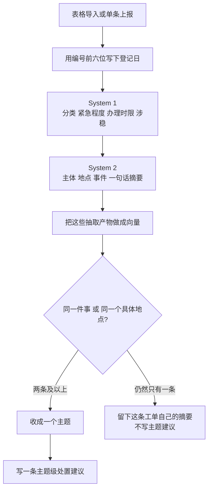

# 12345 政务热线智能工单研判平台 · AI 工作流

每条工单都过 System 1 和 System 2。抽取产物再做向量。只有同一件事，或者同一个具体地点，才收成主题。主题级处置建议只写给两条及以上的主题。登记日从工单编号前六位读取。

---

## 一、一条工单怎么走



图的实现顺序在 [`backend/agent/ticket-agent.ts`](../backend/agent/ticket-agent.ts)：抽取、对齐、聚类、主题建议。

批量入口是 [`lib/cluster-job.ts`](../lib/cluster-job.ts) 的 `executeClusterJob`。它读取该城市 schema 里的全部工单，跑完上面这条流水线，再写回。

---

## 二、各步做什么

### 1. 登记日：`lib/work-order-date.ts`

`250101000770102-01` 拆开是四段：

- `250101`：年月日，2025-01-01
- `000770`：当天递增的受理序号
- `102`：事项代码。同一天里 `109`、`102`、`402` 会反复出现
- `-01`：重办序号。同一单还可以有 `-02`

登记时间记上海时区当天 **00:00**。受理序号不是时分秒：把 `000770` 当成 `00:07:70`，秒数不存在。这张单正文写的来电时间是 `00:43:44`，也不在编号里。

正文里如果写着另一个日期，包括 `2024年12月31日23:59:39`，也不能替换编号上的日期。编号解析不了，才用正文里的时间。入库函数是 [`lib/ticket-ingest.ts`](../lib/ticket-ingest.ts) 的 `buildRecordsFromRows`。已经在库里的工单，分析写回时会按同一规则更新 `create_time`。

非法日期直接放弃，例如 2 月 31 日。

### 2. System 1：每条都跑

文件在 [`packages/civic-system-one`](../packages/civic-system-one/) 和 [`backend/node/extract-node.ts`](../backend/node/extract-node.ts)。

四个头：意图、民生分类、紧急程度、涉稳。共享模型不带某个城市的镇街。模型给出的镇街永远是 `UNKNOWN`，业务不会把 `UNKNOWN` 存成街道名。

落到工单上的是：

- `source_category`：七类民生分类
- `urgency`：`NORMAL` / `MEDIUM` / `URGENT`。涉稳或紧急程度为 3 时写成 `URGENT`
- `sla_hours`：0、120、24、2 小时，对应紧急程度 0 到 3
- `stability_risk`：是否涉稳

咨询和催办也继续交给 System 2。不再因为意图像咨询就跳过抽取。

### 3. System 2：每条都抽实体，并写摘要

本地 Bonsai 2 27B，`enableThinking: false`。思考打开时，输出额度会被思维链用完，正文变空。

每条工单写下：

- `canonical_subject`：主体
- `address`：地点
- `event_type`：事件
- `summarize_title`：一句话摘要

镇街用当前城市词典里的法定镇名。先看 System 1，它现在总是 `UNKNOWN`，所以接着看 System 2 地点里有没有法定镇或街道。社区和地标不会被当成镇街。

主体、事件、摘要、地点都已经在库里，并且置信度大于 0 时，重跑可以不再请 System 2。缺任何一项都会再抽。本地 llama 以 `-np 1` 启动，所以这些调用一次只发一条。

出站前用 [`@civic/anonymizer`](../packages/civic-anonymizer/) 掩掉姓名、电话和证件号，模型返回后再填回来。

### 4. 对齐

[`backend/node/canonical-node.ts`](../backend/node/canonical-node.ts) 用别名字典整理主体和地点的写法。它不把地点改写成词典里的镇名。

### 5. 聚类：向量加上同一件事、同一地点

文件：[`backend/embed-products.ts`](../backend/embed-products.ts)、[`backend/same-incident-cluster.ts`](../backend/same-incident-cluster.ts)、[`backend/node/cluster-node.ts`](../backend/node/cluster-node.ts)。

向量的原文是摘要、主体、事件、地点、镇街、分类，模型是 `BAAI/bge-m3`。接口返回 429 时会等够一分钟再试，不会改用更低的相似度凑数。

两条工单连在一起，满足下面任何一条：

1. [`incidentsMatch`](../backend/ticket-profile.ts) 判定是同一件事。供水故障可以按整段路并。同一条路上的两家欠薪不并。相邻门牌的商业噪音不并。
2. 向量余弦不低于 **0.88**，分类相同且都不是空的，镇街相同且都不是空的，两边地点都具体，并且是同一个小区或地标，或者是同一个不少于 4 个字的具名主体。

门牌都写了但不一样，直接不并。只写了镇街、没有路或小区的「施工噪音」，不并。空镇街不能靠向量并成同一个镇。

主题名优先用大家一致的具体主体。主体是「市民」这类空话时，改用共同的小区或地标，例如东湖学府。质检器会丢掉主体过短或是空泛词的主题。少于 2 条不成主题。

新来的单张工单走 [`backend/incremental-cluster.ts`](../backend/incremental-cluster.ts)，用和批量一样的规则：同一件事，或者向量很近的同一个具体地点。不按相隔多久拆开。时间只用来记节奏。编号没有钟点、又落在同一天时，记为同日，不叫突发。险情升级会把风险调高，并重写这条主题的建议，思考关掉，模型不能改风险等级。

### 6. 主题级处置建议

[`backend/node/summary-node.ts`](../backend/node/summary-node.ts) 只处理已经收成主题的工单。思考关掉，只要 JSON。建议如果是空的，会再要几次，不用同一句套话填上。

单独留下的工单已经有自己的 System 2 摘要，这里不再给它写主题建议。

---

## 三、生产入口

- [app/api/tickets/route.ts](../app/api/tickets/route.ts)：单条接入。新工单先过 System 1 和 System 2，再用和批量一样的规则并入已有主题。
- [app/api/cluster/route.ts](../app/api/cluster/route.ts)：批量研判。读取该城市已入库的工单，跑完整条流水线，替换该城市的主题。

不要对 `public.tickets` 跑这套批量研判。顺德数据在 `region_fs_shunde`。

---

## 四、字段从哪来

抽不出来就空着。不再用「特定涉事方」「关于某地某事的诉求」这类句子填上。

| 字段 | 含义 | 从哪来 |
| :--- | :--- | :--- |
| `create_time` | 登记时间 | 编号前六位，当天 00:00。编号不是日期时才用正文时间 |
| `source_category` | 民生分类 | System 1 |
| `urgency` | 紧急程度 | System 1：`NORMAL` / `MEDIUM` / `URGENT` |
| `sla_hours` | 办理时限 | System 1：0、120、24、2 小时 |
| `stability_risk` | 是否涉稳 | System 1 |
| `canonical_subject` | 主体 | System 2 |
| `address` | 地点 | System 2 |
| `event_type` | 事件 | System 2 |
| `summarize_title` | 这一条的摘要 | System 2 |
| `subdistrict` | 镇街 | 当前城市的法定镇名。模型的 `UNKNOWN` 不入库，对不上就空着 |
| `recommended_action` | 处置建议 | 只写给两条及以上的主题。模型没写出就空着 |

置信度低于 60 的工单进入人工复核队列。不再为了低置信度再叫一次大模型。

---

## 五、核对

这三支是不改库的规则核对，放在 `tests/`。

```bash
npx tsx tests/test-work-order-date.ts
npx tsx tests/test-same-incident-cluster.ts
npx tsx tests/test-incident-profile.ts
```

`scripts/prove-sample-300.ts` 会读取本机表格并改写 `region_fs_shunde`，只在需要重跑样本时手动执行。
