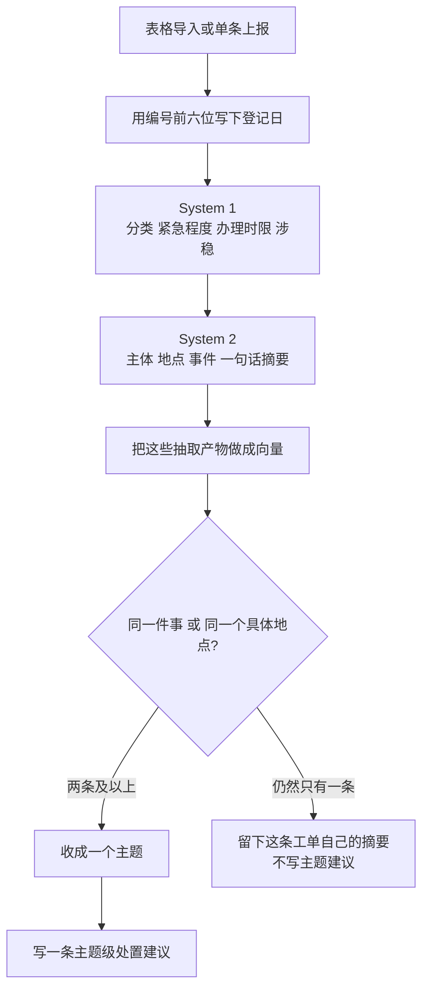

# 12345 政务热线智能工单研判平台 · AI 工作流

每条工单都过 System 1 和 System 2。抽取产物再做向量。只有同一件事，或者同一个具体地点，才收成主题。主题级处置建议只写给两条及以上的主题。登记日从工单编号前六位读取。

---

## 一、一条工单怎么走



图的实现顺序在 [`backend/agent/ticket-agent.ts`](../backend/agent/ticket-agent.ts)：抽取、对齐、聚类、主题建议。

批量入口是 [`lib/cluster-job.ts`](../lib/cluster-job.ts) 的 `executeClusterJob`。它读取该城市 schema 里的全部工单，跑完上面这条流水线，再写回。

---

## 二、各步做什么

### 1. 登记日：`lib/work-order-date.ts`

`250101000770102-01` 拆开是四段：

- `250101`：年月日，2025-01-01
- `000770`：当天递增的受理序号
- `102`：事项代码。同一天里 `109`、`102`、`402` 会反复出现
- `-01`：重办序号。同一单还可以有 `-02`

登记时间记上海时区当天 **00:00**。受理序号不是时分秒：把 `000770` 当成 `00:07:70`，秒数不存在。这张单正文写的来电时间是 `00:43:44`，也不在编号里。

正文里如果写着另一个日期，包括 `2024年12月31日23:59:39`，也不能替换编号上的日期。编号解析不了，才用正文里的时间。入库函数是 [`lib/ticket-ingest.ts`](../lib/ticket-ingest.ts) 的 `buildRecordsFromRows`。已经在库里的工单，分析写回时会按同一规则更新 `create_time`。

非法日期直接放弃，例如 2 月 31 日。

### 2. System 1：每条都跑

文件在 [`packages/civic-system-one`](../packages/civic-system-one/) 和 [`backend/node/extract-node.ts`](../backend/node/extract-node.ts)。

四个头：意图、民生分类、紧急程度、涉稳。共享模型不带某个城市的镇街。模型给出的镇街永远是 `UNKNOWN`，业务不会把 `UNKNOWN` 存成街道名。

落到工单上的是：

- `source_category`：七类民生分类
- `urgency`：`NORMAL` / `MEDIUM` / `URGENT`。涉稳或紧急程度为 3 时写成 `URGENT`
- `sla_hours`：0、120、24、2 小时，对应紧急程度 0 到 3
- `stability_risk`：是否涉稳

咨询和催办也继续交给 System 2。不再因为意图像咨询就跳过抽取。

### 3. System 2：每条都抽实体，并写摘要

本地 Bonsai 2 27B，`enableThinking: false`。思考打开时，输出额度会被思维链用完，正文变空。

每条工单写下：

- `canonical_subject`：主体。正文没有可核验对象时可以为空
- `address`：地点。没有路段或门牌时可以为空，镇街不填进这个字段
- `event_type`：事件
- `summarize_title`：一句话摘要

咨询件经常没有公司和门牌，模型会把主体、地点写成 `null`。[`backend/prompt.ts`](../backend/prompt.ts) 在 Zod 校验前把 `null`、空串、`无`、`未知` 收成空字符串，整批不会因此失败。分类不在七类里时按关键词归入七类，对不上记「社会治理」。镇街写成 `无`、`未知`、`全区`、`空`，或对不上当前城市词典，记 `null`。名称前两字对得上时（如「大良街道」对「大良镇」）改成词典里的法定全称。

[`extract-node.ts`](../backend/node/extract-node.ts) 收下这一行的条件是标题或事件至少有一个。主体为空时把置信度压到不超过 55。地点空着不额外压分。镇街按 System 2 抽出的镇名、地点、已有镇街这个顺序认，认不到就空着。不要因为主体或地点是空就整批重试，也不要丢掉模型已经写出的标题、事件、分类和镇街。

System 1 的镇街恒为 `UNKNOWN`，不会写成街道名。社区和地标不会被当成镇街。

主体、事件、摘要、地点都已经在库里，并且置信度大于 0 时，重跑可以不再请 System 2。缺任何一项都会再抽。本地 llama 以 `-np 1` 启动，所以这些调用一次只发一条。

出站前用 [`@civic/anonymizer`](../packages/civic-anonymizer/) 掩掉姓名、电话和证件号，模型返回后再填回来。

### 4. 对齐

[`backend/node/canonical-node.ts`](../backend/node/canonical-node.ts) 用别名字典整理主体和地点的写法。它不把地点改写成词典里的镇名。

### 5. 聚类：向量加上同一件事、同一地点

文件：[`backend/embed-products.ts`](../backend/embed-products.ts)、[`backend/same-incident-cluster.ts`](../backend/same-incident-cluster.ts)、[`backend/node/cluster-node.ts`](../backend/node/cluster-node.ts)。

向量的原文是摘要、主体、事件、地点、镇街、分类，模型是 `BAAI/bge-m3`。接口返回 429 时会等够一分钟再试，不会改用更低的相似度凑数。

两条工单连在一起，满足下面任何一条：

1. [`incidentsMatch`](../backend/ticket-profile.ts) 判定是同一件事。供水故障可以按整段路并。同一条路上的两家欠薪不并。相邻门牌的商业噪音不并。
2. 向量余弦不低于 **0.88**，分类相同且都不是空的，镇街相同且都不是空的，两边地点都具体，并且是同一个小区或地标，或者是同一个不少于 4 个字的具名主体。

门牌都写了但不一样，直接不并。只写了镇街、没有路或小区的「施工噪音」，不并。空镇街不能靠向量并成同一个镇。

主题名优先用大家一致的具体主体。主体是「市民」这类空话时，改用共同的小区或地标，例如东湖学府。质检器会丢掉主体过短或是空泛词的主题。少于 2 条不成主题。

新来的单张工单走 [`backend/incremental-cluster.ts`](../backend/incremental-cluster.ts)，用和批量一样的规则：同一件事，或者向量很近的同一个具体地点。不按相隔多久拆开。时间只用来记节奏。编号没有钟点、又落在同一天时，记为同日，不叫突发。险情升级会把风险调高，并重写这条主题的建议，思考关掉，模型不能改风险等级。

### 6. 主题级处置建议

[`backend/node/summary-node.ts`](../backend/node/summary-node.ts) 只处理已经收成主题的工单。思考关掉，只要 JSON。建议如果是空的，会再要几次，不用同一句套话填上。

单独留下的工单已经有自己的 System 2 摘要，这里不再给它写主题建议。

---

## 三、生产入口

- [app/api/tickets/route.ts](../app/api/tickets/route.ts)：单条接入。新工单先过 System 1 和 System 2，再用和批量一样的规则并入已有主题。
- [app/api/cluster/route.ts](../app/api/cluster/route.ts)：批量研判。读取该城市已入库的工单，跑完整条流水线，替换该城市的主题。

不要对 `public.tickets` 跑这套批量研判。顺德数据在 `region_fs_shunde`。

### 3.1 研判任务队列（per-region 设计）

批量研判是耗时长（5~30 分钟）的离线作业，UI 不能同步等。所以走 **任务队列** 异步执行。

**表 `public.task_progress`**

每行是一条任务，关键字段：

| 字段 | 含义 |
| :--- | :--- |
| `task_id` | 任务唯一 ID。`auto-<regionId>-<timestamp>` 形式 |
| `region_id` | 绑定的辖区（**per-region 隔离**：每个 region 独立 task 行） |
| `status` | `PENDING` / `RUNNING` / `COMPLETED` / `FAILED` |
| `stage` | `EXTRACTING` / `CLUSTERING` / `SYNTHESIZING` |
| `processed` / `total` | 当前工序进度 |
| `percent` | 加权总进度（S1=2, S2=88, CLUSTER=5, SUMMARY=5；详见 [`lib/pipeline-progress.ts`](../lib/pipeline-progress.ts)） |
| `heartbeat_at` | Worker 每 4~5 秒写一次，超过 20s 没更新视为僵尸 |

**入队：按 region 隔离**

[`lib/cluster-runner.ts`](../lib/cluster-runner.ts) 的 `triggerClusterJobAuto(regionId)`：
1. 查 `region_<id>.tickets` 里 `confidence is null or 0` 的待处理工单数
2. 查 `task_progress` 是否有 `RUNNING` 且心跳 < 20s 的同 region 任务（防止重复入队）
3. 没有就 `enqueueClusterJob(regionId, taskId, total)` 插一条
4. 启动本进程内的 worker 协程消费

**消费：唯一 worker（in-process）**

| Runner | 文件 | 进程 | 触发 | 适合场景 |
| :--- | :--- | :--- | :--- | :--- |
| In-process worker | `lib/cluster-runner.ts` `runWorkerLoopForRegion` | Next.js dev server 同一个 Node 进程 | API 路由里调 `triggerClusterJobAuto(regionId)` 时自动起 per-region 协程 | 所有场景；停 `pnpm dev` 一起死 |

**为什么没有 standalone worker**：之前 `pnpm dev` 还会拉一个独立 tsx 进程 `scripts/cluster-worker.ts`（已删），原意是"Next dev 热重载不打断长任务"。但 standalone 本来就是独立进程，Next dev 重启本来就影响不到它——这层兜底是多余的，反而引入了两个 bug：
1. in-memory `progressStore` 跨进程不共享，导致 `currentLocation` / `currentSubject` / `currentEventType` 在 UI 上时有时无
2. 两个 worker 会同时跑同一 task（log 里看到 `[extract] 14208` 和 `14246` 交替打印），互相争抢 LLM 池

现在只剩 in-process 一个 worker，UI 状态一致，无抢活。

**生命周期与 Kill 行为**

- `pnpm dev` 启两件套：Next dev + System-2 (`llama-server`)。Ctrl+C 后 [`scripts/dev.ts`](../scripts/dev.ts) 的 `cleanUpAndExit` 给两个子进程发 SIGTERM，**轮询 3s** 等它们真退出，到期未退的 SIGKILL 兜底——避免遗留孤儿进程。
- in-process worker 跟 Next dev 同生死：next-server 一停，worker 立即终止。当前 in-flight job 在 `task_progress` 留 `RUNNING` 状态、心跳 30s 后超时，下次重启 next-server 后用户点"开始研判"会被新 worker 重新认领（已抽取工单的 `confidence` 已落库，从断点继续）。
- 恢复路径：worker 死了不需要手动起，新一轮 trigger（用户点按钮 / 上传工单）会自动入队 + 启动新 worker。

**切区时的前端契约**

[`app/_components/civic/civic-workflow.tsx`](../app/_components/civic/civic-workflow.tsx) 的 useEffect 依赖 `activeRegion?.id`，并在切区时立刻 `setTaskProgress(null)` 再 `pollTaskProgress()`。原因：3 秒轮询周期里，旧区的 taskProgress 仍留在 React state，会让顶部 nav 进度环和 `task_progress` API 显示成"上一区还在跑"（最严重时连续 3s 显示错误 region 的 RUNNING + percent）。把 `activeRegion?.id` 加进 useEffect 依赖保证依赖变了就立刻 reset + 拉新区数据。

### 3.2 进度计算：stagePercent 加权公式

进度条在两处消费：
- 顶部 nav 研判图标上的 conic 进度环（[`civic-nav.tsx`](../app/_components/civic/civic-nav.tsx) + Houdini `@property --p`）
- workbench 节点卡片 `03 地点与主体提取` 上的横向进度条（[`pipeline-canvas.tsx`](../app/workbench/_components/pipeline-canvas.tsx)）

不能直接用 `processed / total` 因为 4 个工序耗时差异巨大：
- S1（System-1 ONNX 快思考）：极快，每条 30~80ms，128k 工单约 1~3 小时
- S2（System-2 本地慢思考）：极慢，每条 1.5~6s，128k 工单约 50~200 小时（是绝对瓶颈）
- CLUSTER：聚类，5~15 分钟
- SUMMARY：主题级 LLM 写处置建议，10~30 分钟

如果 S1 阶段按 100% 算，研发看一眼就以为"马上跑完了"；如果按完成工序数等权算（25/50/75/100），S2 阶段的进度爬得太慢、几十小时都看不到动静。

**解决：按工序预估耗时加权**

[`lib/pipeline-progress.ts`](../lib/pipeline-progress.ts)：
```ts
PIPELINE_STAGE_WEIGHTS = { S1: 2, S2: 88, CLUSTER: 5, SUMMARY: 5 }
```
权重之和 = 100%，所以 `percent` 字段始终是 0~100 的整数，可直接交给 CSS 进度环。

`stagePercent(stage, completed, total, phase='live')` 在每段工序的子区间 `[start, end]` 内做线性插值（基于累计权重自动算出）：
- `S1` 的子区间是 `[0, 2]`
- `S2` 的子区间是 `[2, 90]`
- `CLUSTER` 的子区间是 `[90, 95]`
- `SUMMARY` 的子区间是 `[95, 100]`

`phase` 参数：
- `'min'`：取 `start`（工序刚开始时立即跳到本段起点，避免"工单一抽完就变 0%"）
- `'max'`：取 `end`（工序刚结束 / DB 写入前给个封顶值）
- `'live'`（默认）：按 `completed / total` 线性插值

`percent` 写入 `task_progress` 的位置：
- `extract-node.ts`：每抽完一批 50 条写一次 `stagePercent('S2', processed, total)`
- `cluster-node.ts`：开始时 `'min'`，结束时 `themeCount` + 不写 percent
- `summary-node.ts`：每写完一个 batch (10 个主题) 写 `stagePercent('SUMMARY', synthesized, total)`，全部写完前 `phase='max'`

**前端防进位：`Math.floor`**

[`pipeline-canvas.tsx`](../app/workbench/_components/pipeline-canvas.tsx) 计算 `entityPercent` 用 `Math.floor` 而**不是** `Math.round`。原因：S2 跑到 `127999/128000` 时真实比值 99.999%，`Math.round` 进位成 100%，UI 就以为 S2 已完结、CLUSTER 还没起；`Math.floor` 稳定显示 99%，等 `status === 'COMPLETED'` 才显示 100%。

**权重不是真理，是占位**

`{ S1: 2, S2: 88, CLUSTER: 5, SUMMARY: 5 }` 是**视觉占位权重**，不代表实际耗时占比。等真实运行数据（每工序平均 / p95 / p99 耗时）跑出来后可以替换成数据驱动的权重。改这个文件不需要动其他模块——所有节点都走 `stagePercent()` 单一入口。

---

## 四、字段从哪来

抽不出来就空着。`null` 先收成空字符串再入库，不再用「特定涉事方」「关于某地某事的诉求」这类句子填上。主体为空时置信度不超过 55。

| 字段 | 含义 | 从哪来 |
| :--- | :--- | :--- |
| `create_time` | 登记时间 | 编号前六位，当天 00:00。编号不是日期时才用正文时间 |
| `source_category` | 民生分类 | System 1 |
| `urgency` | 紧急程度 | System 1：`NORMAL` / `MEDIUM` / `URGENT` |
| `sla_hours` | 办理时限 | System 1：0、120、24、2 小时 |
| `stability_risk` | 是否涉稳 | System 1 |
| `canonical_subject` | 主体 | System 2 |
| `address` | 地点 | System 2 |
| `event_type` | 事件 | System 2 |
| `summarize_title` | 这一条的摘要 | System 2 |
| `subdistrict` | 镇街 | 当前城市的法定镇名。模型的 `UNKNOWN` 不入库，对不上就空着 |
| `recommended_action` | 处置建议 | 只写给两条及以上的主题。模型没写出就空着 |

置信度低于 60 的工单进入人工复核队列。不再为了低置信度再叫一次大模型。

---

## 五、核对

这三支是不改库的规则核对，放在 `tests/`。

```bash
npx tsx tests/test-work-order-date.ts
npx tsx tests/test-same-incident-cluster.ts
npx tsx tests/test-incident-profile.ts
```

`scripts/prove-sample-300.ts` 会读取本机表格并改写 `region_fs_shunde`，只在需要重跑样本时手动执行。

---

## 六、研判流水线工厂

入口是全站顶部抽屉 [`PipelineDrawer`](../app/_components/civic/pipeline-drawer.tsx)，不是 `/workbench` 页面。窄屏和宽屏用同一块 React Flow 画布 [`pipeline-canvas.tsx`](../app/workbench/_components/pipeline-canvas.tsx)。抽屉标题可以换行。宽度不超过 768px 时抽屉铺满屏幕，状态徽章另起一行。

打开时每秒倒数。任务状态是大写 `RUNNING` 时每 3 秒请求 [`/api/workbench/pipeline-state`](../app/api/workbench/pipeline-state/route.ts)，否则每 10 秒。状态要按大写比较，写成小写会让悬浮胶囊不出现，并一直走慢轮询。

自动刷新会换成新的节点对象。同步时必须留下已经量到的 `measured`、宽高，以及用户拖过的位置。丢掉 `measured` 后，React Flow 把节点设成 `visibility: hidden`；尺寸没变时尺寸观察器不再回调，卡片就整批不出现。

接口对每个 System 2 地址做 `GET /v1/models`，超时 1.5 秒，结果缓存 3 秒。离线的卡片写「无法连接」，不显示耗时。在线耗时优先用该节点记下的 `predicted_ms`，界面一律写成秒。

**节点之间的边线（[flowing-edge.tsx](../app/workbench/_components/flowing-edge.tsx)）**

每条边带 `data.active` / `data.completed` / `data.label` 三个字段，对应三套样式：

| `data.active` | `data.completed` | 视觉 | 何时 |
| :--- | :--- | :--- | :--- |
| `true` | — | 蓝色虚线 (`strokeDasharray: 6,4`) + 流动光点（`<animateMotion>` 1.8s 一圈） | 工序进行中（数据正在流过这段） |
| `false` | `true` | 绿色实线 (`#22C55E`)，透明度 0.65 | 工序已结束，下游已接收 |
| `false` | `false` | 灰色实线 (`#CBD5E1`)，透明度 0.65 | 工序还没开始 |

React Flow 自带的 `animated` prop 也跟 `active` 同源，但**只控制 React Flow 内置的虚线动画**；自绘的 `<animateMotion>` 圆点完全靠 `data.active`。两边都要同步设置，否则会出"React Flow 虚线在动、但没有蓝色光点"或者反过来的不一致。

**坑：edge-ingest-triage 别用 `total > 0` 当 `active` 条件**

2026-10-08 的 bug：第一条边 `active: total > 0`，只要辖区有工单就恒真。任务跑完后这条边一直虚线 + 流动光点。修复：跟其他三条边一致，`active: total > 0 && isRunning`，让"在跑"才进 active 态。教训：**所有 `data.active` 条件必须包含 `isRunning`，否则任务 COMPLETED 之后这条边永远不会"安静"**。

颜色：实线绿 `#22C55E`、虚线蓝 `#3B82F6`、未启动灰 `#CBD5E1`，线宽 1.8 / 2.5 / 1.8，过渡 0.4s。改这套配色只动 `flowing-edge.tsx`，调用方不用关心。
