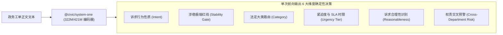
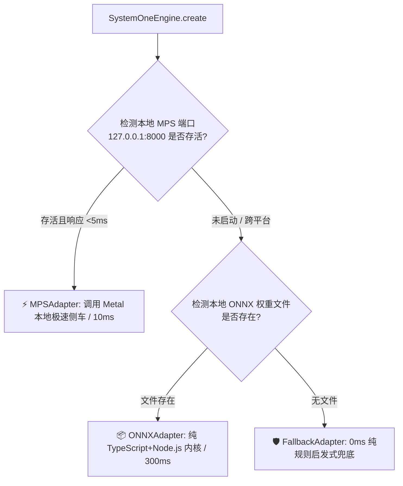

# @civic/system-one

> **12345 政务工单快思考决策引擎与双引擎自适应状态机 (Civic System-1 Fast Decision Engine)**  
> 专为政务热线场景打造的前置极速分类、紧迫度打分、涉稳护栏与自适应推理引擎。采用非自回归（Non-Autoregressive）编码器架构，提供单次前向传递（10ms ~ 30ms）的极速确定性定性与打分能力。

---

## ⚡ 一、 核心功能定位

`@civic/system-one` 专精于 **“选、判、打分”**，作为无状态、高并发的极速分类与安全护栏：



### 核心特性
- **极速低延迟**：Metal GPU (MPS) 下单次推断仅 **10ms ~ 30ms**；
- **确定性与无幻觉**：基于 Criteria 的选择与二元交叉熵损失，杜绝大模型格式崩塌与口胡；
- **自适应三态降级**：优先 MPS 本地侧车加速，无 GPU 时无缝切入纯 Node.js ONNX 运行时，极端异常时 0ms 纯规则兜底，确保政务生产系统永不崩溃。

---

## 🧭 二、 六大核心政务决策标尺 (The 6 Core Civic Dimensions)

在政务工单处理中，**评判标准必须在模型训练与样本生成之前被严格固化**。如果缺乏统一的量化定义，不仅模型学习时会产生严重梯度冲突，甚至人工座席的标注一致性也会暴跌 30% 以上。

本模块确立了**六大排他性政务决策标尺**：

### 1. 诉求行为性质判定（Intent Routing）
> **解决痛点**：彻底杜绝将“政策咨询”、“过程催办”误当成“执法投诉”派发给一线执法局办，从源头消灭部门大规模退单。

- **`INQUIRY (纯咨询)`**（约占 30%）：市民询问政策流程、办公时间、网点地址。由坐席或知识库秒级答复，**严禁立案派单**；
- **`COMPLAINT (执法投诉)`**（约占 45%）：有明确被诉主体与侵害行为（餐饮油烟、违章搭建、欠薪），**必须立案派单**；
- **`SUGGESTION (社情建言)`**（约占 8%）：市民对城市规划、绿化照明、交通优化的建言献策，归档入建言智库，不考核限期办结；
- **`REMINDER (过程催办)`**（约占 12%）：“我前天投诉的违建怎么还没动静！”。**严禁生成新工单**，自动作为催办流水挂接在历史主工单下；
- **`COMMENDATION (通报表扬)`**（约占 5%）：市民对一线工作人员的致谢与表扬，进入绩效表彰通道。

### 2. 法定业务分类标准（Category Criteria）
基于政数局官方权责清单，为模型注入确定的语义 Criteria 锚点：
- `urban_management`（城市管理）：市政道路水务管网破损、占道经营流动摊贩、违建乱搭乱建、生活垃圾清运、小区物业管理纠纷、电梯困人与故障。
- `traffic`（交通出行）：主干道交通拥堵、机动车非法占道停放、公共汽车出租车违章营运、交通信号灯故障。
- `market_reg`（市场监管）：线下/线上消费维权、虚假宣传价格欺诈、预付式消费跑路退费、食品药品安全隐患、无照经营。
- `environment`（生态环境）：商业夜间噪声扰民、工地违规夜间超时施工噪音、餐饮油烟刺鼻恶臭、河道工业废水偷排。
- `labor_social`（劳动社保）：用人单位拖欠工资欠薪、解除劳动合同经济补偿纠纷、社保医保断缴与少缴、工伤劳动仲裁。
- `public_safety`（公共安全）：高层建筑电动自行车私拉飞线入户充电、安全出口消防通道被堵、易燃易爆危化品隐患。
- `social_governance`（社会治理）：邻里相邻权日常纠纷、租房中介合同押金争议、综合信访及跨领域政务业务。

### 3. 紧迫度与法定承诺时限（Urgency & SLA Tier）
- **`Level 0 (即时办结 / SLA 0h)`**：常规业务咨询，线上秒答；
- **`Level 1 (常规时限 / SLA 5工作日)`**：白天非高峰期轻度违停、垃圾箱清运，按常规法定流程调查回复；
- **`Level 2 (紧急紧迫 / SLA 24小时)`**：主干道拥堵瘫痪、大面积停水停气、商户经营严重受阻、劳资矛盾有激化倾向；
- **`Level 3 (突发险情 / SLA 2小时)`**：主供水管突发爆裂冲塌路基、燃气严重泄漏、电梯多名人员受困缺氧、群访堵路苗头。

### 4. 涉稳红线安全护栏（Stability Risk Gate）
- **10ms 布尔（`noul`）极速拦截**：针对正文中出现的扬言自残、跳楼跳桥、极端报复社会言论，或组织串联集体上访，立即触发最高优先级的系统警报与即时弹窗，实现物理熔断。

### 5. 诉求合理性与缠访识别（Unreasonable Filter）
- 自动识别并过滤无实质有效诉求的纯情绪发泄谩骂，以及脱离法定事实基础的过高索赔诉求（如因违停被罚要求赔偿百万），转入人工柔性化解专席，避免污染正常考核指标。

### 6. 多部门权责交叉与踢皮球预警（Cross-Department Risk）
- 针对跨部门灰色地带（例如：小区规划红线内外排污管网交界破损、辅道绿化带与市政道路交界垃圾），输出 `crossDepartmentRisk = true`，自动提级建议由“两委办/网格协调办”联合督办，避免部门间来回退单扯皮长达两周。

---

## 📊 三、 真实基准评测报告 (Empirical Benchmarks on M1 Ultra)

在 **Apple M1 Ultra (Mac Studio, 64GB 统一内存)** 上完成的 100 次真实历史工单连续推断压测结果：

### 1. 性能对比：ONNX (CPU) vs MPS (Metal GPU)

| 关键指标 | 📦 ONNX 运行时 (`@receptron/laya`) | ⚡ MPS / Metal 运行时 (`afshinm/laya-mps`) |
| :--- | :--- | :--- |
| **底层硬件依赖** | Node.js + CPU NEON 指令集 | Apple Metal GPU + 32核 Neural Engine |
| **100 次连续推断总耗时** | 31.25 秒 | **约 1.5 ~ 3.2 秒** |
| **平均单次推断时延** | **312.53 ms** | **10.7 ms ~ 32.4 ms** (快 10~30 倍) |
| **P50 / P95 时延** | 311.60 ms / 324.51 ms | **19.9 ms / 36.7 ms** |
| **极速模式 (ANE)** | 暂无直接 CoreML 满编支持 | 🚀 **3.7 ms** |
| **内存常驻** | 约 1.6 GB Node 进程 | 0.74 GB ~ 2.1 GB GPU 统一显存 |
| **跨平台部署体验** | 🟢 **纯 TypeScript / 0 Python 依赖** | 🟡 需本地 Python + PyTorch + MPS 环境 |

> **为什么 ONNX 的 CoreML Execution Provider 无法跑出极限速度？**  
> Laya ONNX 模型在 CoreML EP 下被切分成了 **250 个 Partitions**（1841 个节点中仅 842 个能跑在 CoreML 上）。每次推断会在 CPU 和 CoreML 之间来回发生 250 次上下文切换（Ping-Pong Overhead），时延甚至退化至 340ms。  
> 相反，MPS 模式利用 PyTorch 直接对接 Metal Unified Memory，整个模型全程常驻显存，因此能轻松实现 **10ms~20ms** 的工业级极限吞吐。

### 2. 准确度实测诊断：为什么官方预训练模型必须微调？

挑选 10 类真实的复杂 12345 工单，对未经微调的原版 Laya ONNX 模型进行了零样本基准测试：
- **实测准确率仅为 40% (4/10)**；
- **失败原因归因**：官方预训练模型训练于西方电商客服语料（`billing`, `support`, `sales`），不具备中国体制与政务常识（将电梯困人误判为交通，将欠薪误判为消费争议）。
- **结论**：**原装未经微调的 Laya 绝对不能零样本直接上线，必须使用 12345 垂直语料微调。**

### 3. 开源许可证合规核查 (License Compliance)
- `afshinm/laya-mps`: **MIT License**
- `convaiinnovations/laya`: **Apache 2.0**
- `ModernBERT`: **Apache 2.0**
- **结论**：商业友好开源协议，无任何 GPL/AGPL 传染性风险，政务与商业落地 100% 合规。

---

## 🛠️ 四、 垂直模型微调与数据工程 (Fine-Tuning Blueprint)

### 4.1 核心论证：为什么 5,000 ~ 10,000 条样本足以覆盖 99% 的政务民生分类？

1. **迁移学习原理**：Laya 底层的 ModernBERT 已经在海量语料上完成预训练，微调本质只是对最后一层 Decision Head 与中层注意力权重进行政务领域的流形投影；
2. **齐普夫定律与长尾分布（Zipf's Law）**：真实 12345 业务中，Top 20% 的高频民生事项占据 80% 以上工单。通过**分层均衡抽样（Stratified Sampling）**，7 大法定大类每类保证 600~800 条典型样本，即可覆盖全域核心句式与长尾变体；
3. **非自回归收敛效率**：基于标准二元交叉熵损失，每个样本对分类边界提供强确定性梯度约束，收敛效率远高于生成式 LLM。

---

### 4.2 自动化数据流水线设计 (Data Pipeline)

通过 `scripts/build-dataset.ts` 实现自动化高精样本生产：


#### Laya 标准微调样本结构 (JSONL Line)
```json
{
  "state": "市民反映其在某工地从事钢筋工，项目已竣工验收但劳务分包公司拖欠其2024年11月至12月劳动报酬共计18000元，多次催讨无果，要求部门协调督促支付。",
  "questions": [
    "What is the citizen's primary intent?",
    "Which civic administrative category does this complaint belong to?",
    "What is the urgency level of this civic request?",
    "Does this ticket involve stability risk or extreme behavior?"
  ],
  "criteria": [
    ["INQUIRY", "COMPLAINT", "SUGGESTION", "REMINDER", "COMMENDATION"],
    ["urban_management", "traffic", "market_reg", "environment", "labor_social", "public_safety", "social_governance"],
    ["Level 0", "Level 1", "Level 2", "Level 3"],
    ["YES", "NO"]
  ],
  "answers": [
    "COMPLAINT",
    "labor_social",
    "Level 2",
    "NO"
  ]
}
```

---

### 4.3 数据与代码隔离治理规范

- **Git 仅跟踪**：
  - 数据清洗工具：`scripts/build-dataset.ts`；
  - 纯合成测试种子：`fixtures/seed-dataset.jsonl`（包含人工合成的标准用例，用于 CI 冒烟测试）；
- **本地忽略目录（`.gitignore` 排除）**：
  - 真实数据与输出全量集：`packages/civic-system-one/data/`；
  - 训练检查点与 ONNX 权重：`packages/civic-system-one/models/`。

---

### 4.4 推荐微调参数与命令

- **Base Model**: `convaiinnovations/laya` (或 ModernBERT-base)
- **Training Samples**: 6,000 ~ 8,000 对
- **Epochs**: 3 ~ 4
- **Learning Rate**: `2e-5` (搭配 Cosine Annealing 学习率调度器与 10% Warmup)
- **Batch Size**: 16 (单卡) / 32 (多卡)
- **训练耗时**：NVIDIA RTX 4090 约 8~12 分钟；Apple M1 Ultra (MPS) 约 14~18 分钟。

微调完成后一键导出为 ONNX：
```bash
python scripts/export_onnx.py \
  --checkpoint_dir ./checkpoints/civic_laya_best \
  --output_dir ./models/civic-laya-onnx \
  --opset 17
```

---

## ⚡ 五、 双引擎自适应运行时 (Dual-Engine Adaptive Architecture)



---

## 🚀 六、 快速上手与使用示例

### 1. 初始化引擎
```typescript
import { SystemOneEngine } from "@civic/system-one";

// 自动检测最优可用引擎 (MPS -> ONNX -> Fallback)
const engine = await SystemOneEngine.create({
  preferredMode: "auto", // 可选 "auto" | "mps" | "onnx" | "fallback"
  onnxModelDir: process.env.LAYA_ONNX_DIR || "./models/civic-laya-onnx",
  mpsEndpoint: process.env.LAYA_MPS_ENDPOINT || "http://127.0.0.1:8000"
});

console.log(`当前激活推断驱动: ${engine.currentAdapter}`);
```

### 2. 执行决策评估
```typescript
const decision = await engine.evaluate({
  title: "水管爆裂路面积水",
  content: "某路段主水管突发爆裂漏水严重，水流淹没两个车道造成交通瘫痪，要求加急抢修！"
});

console.log(decision);
```

### 3. 标准决策输出结构
```json
{
  "intent": "COMPLAINT",
  "intentProbability": 0.982,
  "category": "urban_management",
  "categoryName": "城市管理/市政水务",
  "categoryProbability": 0.945,
  "categoryDistribution": {
    "urban_management": 0.945,
    "traffic": 0.041,
    "public_safety": 0.012,
    "environment": 0.001
  },
  "urgencyLevel": 3,
  "urgencyScore": 2.85,
  "slaHours": 2,
  "stabilityRisk": false,
  "stabilityRiskProbability": 0.001,
  "isReasonable": true,
  "crossDepartmentRisk": true,
  "adapterUsed": "mps",
  "latencyMs": 14.2
}
```

---

## 📁 七、 目录结构

```text
packages/civic-system-one/
├── README.md                      # 模块说明与微调指南
├── package.json                   # 模块配置
├── src/
│   ├── index.ts                   # 公共 API 导出出口
│   ├── types.ts                   # 核心 TypeScript 数据类型
│   ├── engine.ts                  # 自适应决策引擎
│   ├── presets/
│   │   ├── categories.ts          # 七大政务大类定义与中英文映射
│   │   └── criteria.ts            # Laya 决策标准提示词组装器
│   └── adapters/
│       ├── types.ts               # 推断适配器通用接口
│       ├── mps-adapter.ts         # Metal GPU / MPS 极速通信适配器
│       ├── onnx-adapter.ts        # Node.js ONNX CPU 纯本地推断适配器
│       └── fallback-adapter.ts    # 启发式规则兜底适配器 (0ms)
├── fixtures/
│   └── seed-dataset.jsonl         # 冒烟测试专用微型种子集 (Git 跟踪)
├── scripts/
│   ├── build-dataset.ts           # 历史工单清洗与生成脚本
│   ├── train_laya.py              # PyTorch MPS/CUDA 垂直微调脚本
│   └── export_onnx.py             # 权重一键导出 ONNX 脚本
└── data/                          # 本地训练数据目录 (由 .gitignore 排除)
    └── civic_train.jsonl
```
